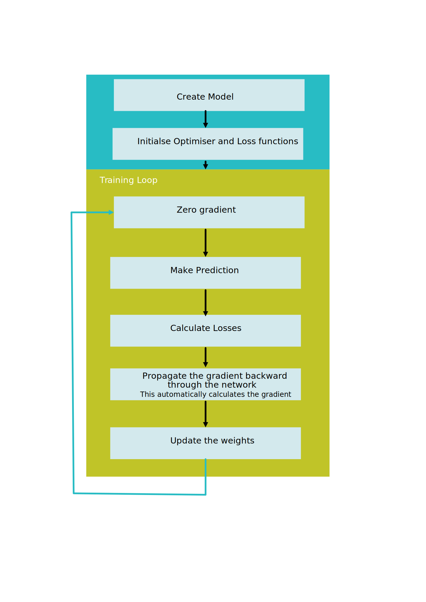
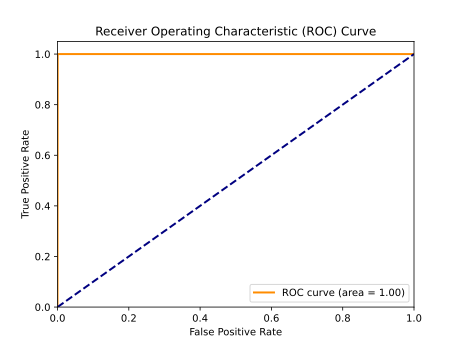

# One Hot Encoder

## Overview

One hot encoding is a process of converting categorical data variables so they can be provided to machine learning algorithms to improve predictions. One hot encoding is a crucial part of feature engineering for machine learning.

Categorical data refers to variables that are made up of label values, for example, a “color” variable could have the values “red,” “blue,” and “green.” Think of values like different categories that sometimes have a natural ordering to them.

Some machine learning algorithms can work directly with categorical data depending on implementation, such as a decision tree, but most require any inputs or outputs variables to be a number, or numeric in value. This means that any categorical data must be mapped to integers.

One hot encoding is one method of converting data to prepare it for an algorithm and get a better prediction. With one-hot, we convert each categorical value into a new categorical column and assign a binary value of 1 or 0 to those columns. Each integer value is represented as a binary vector. All the values are zero, and the index is marked with a 1.




A line in the log indicating an error would be  labelled 1, while a normal entry would be 0.

| Classification | Normal_Onehot | Error_Onehot |
| -------------- | ------------- | ------------ |
| Error        |   0           |   1          |
| Normal         |   1           |   0          |

Once we assign numeric values, we create a binary vector that represents our numerical values. In this case, our vector will have 2 as its length since we have 2 values. Thus, the "Error" value can be represented with the binary vector [1,0], and the "Normal" value will be represented as [0,1].

## Onehot Encoding of Syslog

Below is a sample of the syslog data. The comma separated values correspond to Data/Time, Application Name, Log Detail and Error Classification, where 1 indicates an error and 0 represents a normal log entry.

```txt
Date/Time,Application,Detail,Label
Sep 14 09:00:04,systemd[1]:,Starting Time & Date Service...,0
Sep 14 09:00:04,dbus-daemon[678]:,[system] Successfully activated service 'org.freedesktop.timedate1',0
Sep 14 09:00:04,systemd[1]:,Started Time & Date Service.,0
```

## Performance

```txt
X train: (27931,), y train: (27931,)
X test: (27932,), y test: (27932,)
X_train_onehot.shape[1] = 8939
----------------------------------------

Epoch 0, Loss: 38.650621116161346
Epoch 1, Loss: 21.29745677113533
Epoch 2, Loss: 11.20891223847866
Epoch 3, Loss: 6.116560071706772
Epoch 4, Loss: 3.7343415580689907
Epoch 5, Loss: 2.5143870413303375
Epoch 6, Loss: 1.8165911734104156
Epoch 7, Loss: 1.3848383016884327
Epoch 8, Loss: 1.0912862494587898
Epoch 9, Loss: 0.8871778817847371
Epoch 10, Loss: 0.7381690302863717
Epoch 11, Loss: 0.6213934812694788
Epoch 12, Loss: 0.5328583079390228
Epoch 13, Loss: 0.46212757704779506
Epoch 14, Loss: 0.4065693221054971
Epoch 15, Loss: 0.35869634291157126
Epoch 16, Loss: 0.31918484391644597
Epoch 17, Loss: 0.28641971945762634
Epoch 18, Loss: 0.25826839567162097
Epoch 19, Loss: 0.23454228276386857
Epoch 20, Loss: 0.2135961134918034
Epoch 21, Loss: 0.19588726828806102
Epoch 22, Loss: 0.17996801435947418
Epoch 23, Loss: 0.16566902888007462
Epoch 24, Loss: 0.15314858336932957
Epoch 25, Loss: 0.14192283258307725
Epoch 26, Loss: 0.13187490939162672
Epoch 27, Loss: 0.12362808338366449
Epoch 28, Loss: 0.11520187114365399
Epoch 29, Loss: 0.1081097184214741
Epoch 30, Loss: 0.10122084454633296
Epoch 31, Loss: 0.09547382406890392
Epoch 32, Loss: 0.09015304979402572
Epoch 33, Loss: 0.08395888301311061
Epoch 34, Loss: 0.07980578148271888
Epoch 35, Loss: 0.07564804388675839
Epoch 36, Loss: 0.07117910869419575
Epoch 37, Loss: 0.0676415532361716
Epoch 38, Loss: 0.06404023780487478
Epoch 39, Loss: 0.060905685008037835
Epoch 40, Loss: 0.05781389673938975
Epoch 41, Loss: 0.05514182505430654
Epoch 42, Loss: 0.052461564424447715
Epoch 43, Loss: 0.050359969201963395
Epoch 44, Loss: 0.04788533539976925
Epoch 45, Loss: 0.04578944214154035
Epoch 46, Loss: 0.043854907067725435
Epoch 47, Loss: 0.04169881748384796
Epoch 48, Loss: 0.04014870661194436
Epoch 49, Loss: 0.03830667011789046
Epoch 50, Loss: 0.03695332069764845
Epoch 51, Loss: 0.03539401094894856
Epoch 52, Loss: 0.03376110264798626
Epoch 53, Loss: 0.0326754663255997
Epoch 54, Loss: 0.031156942684901878
Epoch 55, Loss: 0.030219385167583823
Epoch 56, Loss: 0.029050602490315214
Epoch 57, Loss: 0.027874244609847665
Epoch 58, Loss: 0.026746713658212684
Epoch 59, Loss: 0.02593043097294867
Epoch 60, Loss: 0.025054422818357125
Epoch 61, Loss: 0.023926082241814584
Epoch 62, Loss: 0.023140728299040347
Epoch 63, Loss: 0.02222853375133127
Epoch 64, Loss: 0.021484848926775157
Epoch 65, Loss: 0.02072800741007086
Epoch 66, Loss: 0.020024836878292263
Epoch 67, Loss: 0.01932116868556477
Epoch 68, Loss: 0.01866293023340404
Epoch 69, Loss: 0.018002547119976953
Epoch 70, Loss: 0.01734965154173551
Epoch 71, Loss: 0.01673587867844617
Epoch 72, Loss: 0.01620927815383766
Epoch 73, Loss: 0.01565486619801959
Epoch 74, Loss: 0.015283211410860531
Epoch 75, Loss: 0.014742824336281046
Epoch 76, Loss: 0.01418761790409917
Epoch 77, Loss: 0.01382078404276399
Epoch 78, Loss: 0.013428531674435362
Epoch 79, Loss: 0.012874416817794554
Epoch 80, Loss: 0.012468125249142759
Epoch 81, Loss: 0.012096876846044324
Epoch 82, Loss: 0.011844720560475253
Epoch 83, Loss: 0.011327732347126585
Epoch 84, Loss: 0.010994171389029361
Epoch 85, Loss: 0.010712669889471726
Epoch 86, Loss: 0.010327992968086619
Epoch 87, Loss: 0.010190244451223407
Epoch 88, Loss: 0.00982998249673983
Epoch 89, Loss: 0.009525860761641525
Epoch 90, Loss: 0.009127286619332153
Epoch 91, Loss: 0.008892268961062655
Epoch 92, Loss: 0.00859793743074988
Epoch 93, Loss: 0.008332821838848758
Epoch 94, Loss: 0.00813073035897105
Epoch 95, Loss: 0.007852086178900208
Epoch 96, Loss: 0.007627011498698266
Epoch 97, Loss: 0.007383124571788358
Epoch 98, Loss: 0.007172812907811021
Epoch 99, Loss: 0.0069779401674168184
y_test_pred_np.shape (27932,)  y_test_pred torch.Size([27932])
y_test.shape (27932,)
-------------------------------------

The accuracy of the model is 99.9%.
Naive Classifier: 97.3 %
```

## Loss Curve


## Confusion Matrix


The above confusion matrix indicates 0 type 1 erros (False Positives) and 14 type 2 errors (False Negatives)

## Receiver Operating Characteristic (ROC) curves

The Receiver Operating Characteristic (ROC) curve is a graphical representation of the performance of a binary classification model at various classification thresholds. It is a widely used tool for evaluating the trade-off between the True Positive Rate (Sensitivity) and the False Positive Rate at different decision thresholds.

True Positive Rate:

```txt
TPR = True Positives/ (False Negatives + True Positives)
``` 

The True Positive Rate measures the proportion of actual positive instances that are correctly predicted as positive. It is also known as Sensitivity or Recall.  A high TPR indicates that the model is effective at capturing positive instances.


False Positive Rate: 

```txt
FPR = False Positives/ (False Positives + True Negatives)
``` 

The False Positive Rate measures the proportion of actual negative instances that are incorrectly predicted as positive. A low FPR indicates that the model is not producing many false positives.

ROC curves are particularly useful for comparing and selecting models. A model with a curve that is closer to the upper-left corner (higher TPR and lower FPR) generally performs better.

The ROC curve helps in selecting an appropriate classification threshold based on the specific requirements of the application. Depending on the use case, you may prioritize sensitivity (minimizing false negatives) or specificity (minimizing false positives).



Area Under the Curve (AUC):

The AUC-ROC metric quantifies the overall performance of the model. A higher AUC value (closer to 1) indicates better discrimination between positive and negative instances across various thresholds. However, area under the curve as a means of comparison should be evaluated with caution depending on the relative importance of a false positive versus a false negative.


