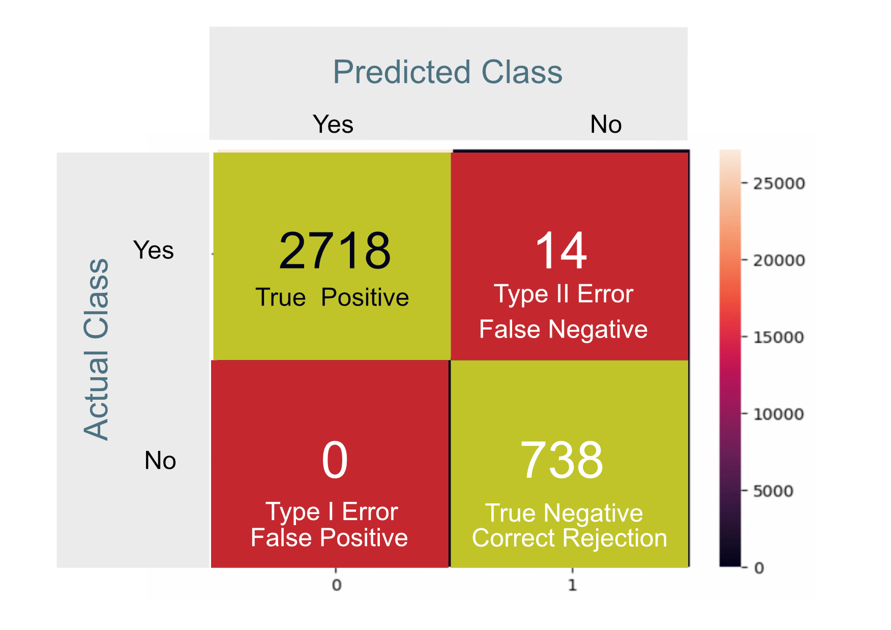

# One Hot Encoder

## Overview

One hot encoding is a process of converting categorical data variables so they can be provided to machine learning algorithms to improve predictions. One hot encoding is a crucial part of feature engineering for machine learning.

Categorical data refers to variables that are made up of label values, for example, a “color” variable could have the values “red,” “blue,” and “green.” Think of values like different categories that sometimes have a natural ordering to them.

Some machine learning algorithms can work directly with categorical data depending on implementation, such as a decision tree, but most require any inputs or outputs variables to be a number, or numeric in value. This means that any categorical data must be mapped to integers.

One hot encoding is one method of converting data to prepare it for an algorithm and get a better prediction. With one-hot, we convert each categorical value into a new categorical column and assign a binary value of 1 or 0 to those columns. Each integer value is represented as a binary vector. All the values are zero, and the index is marked with a 1.


A line in the log indicating an error would be  labelled 1, while a normal entry would be 0.

| Classification | Normal_Onehot | Error_Onehot |
| -------------- | ------------- | ------------ |
| Error        |   0           |   1          |
| Normal         |   1           |   0          |

Once we assign numeric values, we create a binary vector that represents our numerical values. In this case, our vector will have 2 as its length since we have 2 values. Thus, the "Error" value can be represented with the binary vector [1,0], and the "Normal" value will be represented as [0,1].


## Onehot Encoding of Syslog

Below is a sample of the syslog data. The comma separated values correspond to Data/Time, Application Name, Log Detail and Error Classification, where 1 indicates an error and 0 represents a normal log entry.

```txt
Date/Time,Application,Detail,Label
Sep 14 09:00:04,systemd[1]:,Starting Time & Date Service...,0
Sep 14 09:00:04,dbus-daemon[678]:,[system] Successfully activated service 'org.freedesktop.timedate1',0
Sep 14 09:00:04,systemd[1]:,Started Time & Date Service.,0
```


## Confusion Matrix

