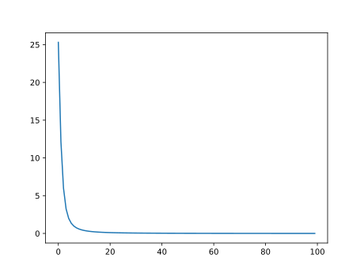

# One Hot Encoder

## Overview

One hot encoding is a process of converting categorical data variables so they can be provided to machine learning algorithms to improve predictions. One hot encoding is a crucial part of feature engineering for machine learning.

Categorical data refers to variables that are made up of label values, for example, a “color” variable could have the values “red,” “blue,” and “green.” Think of values like different categories that sometimes have a natural ordering to them.

Some machine learning algorithms can work directly with categorical data depending on implementation, such as a decision tree, but most require any inputs or outputs variables to be a number, or numeric in value. This means that any categorical data must be mapped to integers.

One hot encoding is one method of converting data to prepare it for an algorithm and get a better prediction. With one-hot, we convert each categorical value into a new categorical column and assign a binary value of 1 or 0 to those columns. Each integer value is represented as a binary vector. All the values are zero, and the index is marked with a 1.


A line in the log indicating an error would be  labelled 1, while a normal entry would be 0.

| Classification | Normal_Onehot | Error_Onehot |
| -------------- | ------------- | ------------ |
| Error        |   0           |   1          |
| Normal         |   1           |   0          |

Once we assign numeric values, we create a binary vector that represents our numerical values. In this case, our vector will have 2 as its length since we have 2 values. Thus, the "Error" value can be represented with the binary vector [1,0], and the "Normal" value will be represented as [0,1].

## Onehot Encoding of Syslog

Below is a sample of the syslog data. The comma separated values correspond to Data/Time, Application Name, Log Detail and Error Classification, where 1 indicates an error and 0 represents a normal log entry.

```txt
Date/Time,Application,Detail,Label
Sep 14 09:00:04,systemd[1]:,Starting Time & Date Service...,0
Sep 14 09:00:04,dbus-daemon[678]:,[system] Successfully activated service 'org.freedesktop.timedate1',0
Sep 14 09:00:04,systemd[1]:,Started Time & Date Service.,0
```

## Performance

```txt
X train: (27931,), y train: (27931,)
X test: (27932,), y test: (27932,)
X_train_onehot.shape[1] = 8939
--------------------------------
Epoch 0, Loss: 31.252718329429626
Epoch 1, Loss: 17.24858383834362
Epoch 2, Loss: 8.714141875505447
Epoch 3, Loss: 4.5526650957763195
Epoch 4, Loss: 2.723725028336048
Epoch 5, Loss: 1.8105735518038273
Epoch 6, Loss: 1.301117280498147
Epoch 7, Loss: 0.9834527764469385
Epoch 8, Loss: 0.7758633252233267
Epoch 9, Loss: 0.6296248706057668
Epoch 10, Loss: 0.5207215794362128
Epoch 11, Loss: 0.43811528757214546
Epoch 12, Loss: 0.37530670315027237
Epoch 13, Loss: 0.3259619125165045
Epoch 14, Loss: 0.28546328213997185
Epoch 15, Loss: 0.25261316006071866
Epoch 16, Loss: 0.22424732381477952
Epoch 17, Loss: 0.20103158429265022
Epoch 18, Loss: 0.18167693400755525
Epoch 19, Loss: 0.16475635906681418
Epoch 20, Loss: 0.14980623149313033
Epoch 21, Loss: 0.1373229364398867
Epoch 22, Loss: 0.1262012723600492
Epoch 23, Loss: 0.11646446620579809
Epoch 24, Loss: 0.10800902044866234
Epoch 25, Loss: 0.09984773304313421
Epoch 26, Loss: 0.0926381015451625
Epoch 27, Loss: 0.08624061738373712
Epoch 28, Loss: 0.08125322440173477
Epoch 29, Loss: 0.07572143292054534
Epoch 30, Loss: 0.0709730235976167
Epoch 31, Loss: 0.06687687488738447
Epoch 32, Loss: 0.06274353602202609
Epoch 33, Loss: 0.058978895569453016
Epoch 34, Loss: 0.055813644314184785
Epoch 35, Loss: 0.05296104069566354
Epoch 36, Loss: 0.05012742453254759
Epoch 37, Loss: 0.04734171513700858
Epoch 38, Loss: 0.04522673270548694
Epoch 39, Loss: 0.04270896909292787
Epoch 40, Loss: 0.04061527902376838
Epoch 41, Loss: 0.03859582747099921
Epoch 42, Loss: 0.036830597557127476
Epoch 43, Loss: 0.0351602656301111
Epoch 44, Loss: 0.03355123897199519
Epoch 45, Loss: 0.031967220158549026
Epoch 46, Loss: 0.030695921479491517
Epoch 47, Loss: 0.029248070844914764
Epoch 48, Loss: 0.028016946860589087
Epoch 49, Loss: 0.026830592192709446
Epoch 50, Loss: 0.025819306349148974
Epoch 51, Loss: 0.024705216535949148
Epoch 52, Loss: 0.023789479935658164
Epoch 53, Loss: 0.022752225020667538
Epoch 54, Loss: 0.021846695643034764
Epoch 55, Loss: 0.02099392253148835
Epoch 56, Loss: 0.020386682605021633
Epoch 57, Loss: 0.01951088554051239
Epoch 58, Loss: 0.01868609404482413
Epoch 59, Loss: 0.017988039326155558
Epoch 60, Loss: 0.017406005747034214
Epoch 61, Loss: 0.01681273790745763
Epoch 62, Loss: 0.01626751529693138
Epoch 63, Loss: 0.015554149358649738
Epoch 64, Loss: 0.014960051368689165
Epoch 65, Loss: 0.014403407876670826
Epoch 66, Loss: 0.013902342885558028
Epoch 67, Loss: 0.013553405238781124
Epoch 68, Loss: 0.012983600383449811
Epoch 69, Loss: 0.01259218089398928
Epoch 70, Loss: 0.012162448518211022
Epoch 71, Loss: 0.011708015932526905
Epoch 72, Loss: 0.011328500957461074
Epoch 73, Loss: 0.010992180519679096
Epoch 74, Loss: 0.010592093072773423
Epoch 75, Loss: 0.010302382179361302
Epoch 76, Loss: 0.009906525294354651
Epoch 77, Loss: 0.00964537043182645
Epoch 78, Loss: 0.009286805245210417
Epoch 79, Loss: 0.009114752672758186
Epoch 80, Loss: 0.008691358321812004
Epoch 81, Loss: 0.008473558307741769
Epoch 82, Loss: 0.008180108001397457
Epoch 83, Loss: 0.007919670973933535
Epoch 84, Loss: 0.007696918990404811
Epoch 85, Loss: 0.0074988260930695105
Epoch 86, Loss: 0.007203107983514201
Epoch 87, Loss: 0.006979924488405231
Epoch 88, Loss: 0.006815843040385516
Epoch 89, Loss: 0.006552806928084465
Epoch 90, Loss: 0.006356558391416911
Epoch 91, Loss: 0.006164593105495442
Epoch 92, Loss: 0.00599747502928949
Epoch 93, Loss: 0.005807993111375254
Epoch 94, Loss: 0.00563676335150376
Epoch 95, Loss: 0.0054578866802330595
Epoch 96, Loss: 0.005338054041203577
Epoch 97, Loss: 0.00522060159346438
Epoch 98, Loss: 0.005001553756301291
Epoch 99, Loss: 0.004858361200604122
------------------------------------

Naive Classifier: 97.3 %
```

## Loss Curve




## Confusion Matrix

