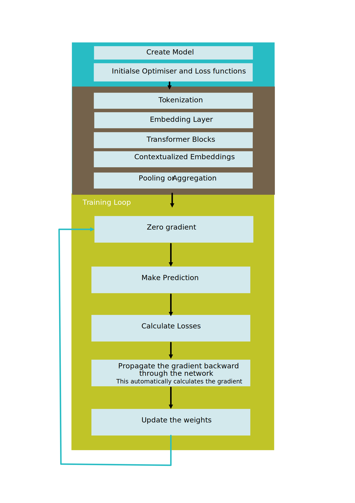
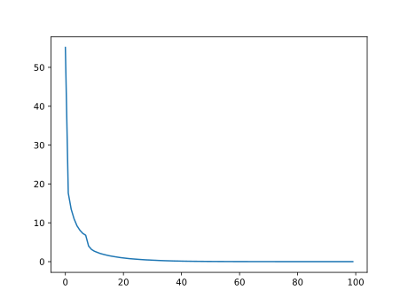
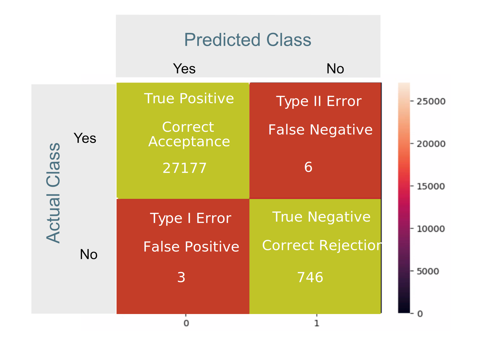
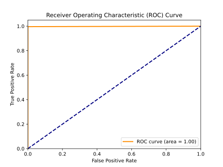

# Sentence Embedding

## Overview




The encoding performed by the SentenceTransformer model is based on contextualized embeddings of entire sentences, not individual words. The model uses a transformer architecture, which processes input sequences as a whole, taking into account the relationships and dependencies between words in the context of the entire sentence.

The process of sentence embedding involves a number of steps:

- Tokenization: The input sentence is tokenized into subword or word-level tokens. Each token is associated with an embedding vector.
- Embedding Layer: The embeddings of the individual tokens are passed through an embedding layer to obtain initial representations.
- Positional Encoding: The model incorporates information about the position of tokens in the sequence to handle the sequential nature of the input. This is achieved by adding positional encoding to the token embeddings.
- Transformer Blocks: The processed embeddings are then passed through multiple transformer blocks. Each block contains attention mechanisms that allow the model to focus on different parts of the input sequence when generating representations.
- Contextualized Embeddings: The output of the transformer blocks is a set of contextualized embeddings for each token. These embeddings capture the relationships and contextual information of each token within the entire sentence.
- Pooling or Aggregation: The model might use pooling or aggregation techniques to obtain a single vector representation for the entire sentence. This aggregated representation is often what is returned as the final encoding. There are a number of techniques that can be used for pooling and these include:
  - Max Pooling: For each dimension of the word embeddings, the maximum value across all the words in the sequence is taken.
This method captures the most salient features present in any word across the sequence.
  - Mean Pooling: For each dimension of the word embeddings, the mean (average) value across all the words in the sequence is calculated. This method provides a representation that considers the overall distribution of features in the sequence.
  - Sum Pooling: For each dimension of the word embeddings, the sum of values across all the words in the sequence is computed.
This method emphasizes the cumulative effect of features present in different words.
  - Weighted Pooling: Assigns different weights to word embeddings based on their importance. The weights can be learned during training or predefined based on some criterion. 
  - CLS Token Pooling (BERT-style): In models like BERT (Bidirectional Encoder Representations from Transformers), a special token ([CLS]) is used to represent the entire sequence. The output of this [CLS] token is often used as the aggregated representation for the entire sentence.

## Pretrained Model

```txt
all-mpnet-base-v2 
Description:	All-round model tuned for many use-cases. Trained on a large and diverse dataset of over 1 billion training pairs.
Base Model:	microsoft/mpnet-base
Max Sequence Length:	384
Dimensions:	768
Normalized Embeddings:	true
Suitable Score Functions:	dot-product (util.dot_score), cosine-similarity (util.cos_sim), euclidean distance
Size:	420 MB
Pooling:	Mean Pooling
Training Data:	1B+ training pairs. For details, see model card.
Model Card:	https://huggingface.co/sentence-transformers/all-mpnet-base-v2
```


## Classification

For the syslog classification task a line in the log indicating an error would be  labelled 1, while a normal entry would be 0.


Below is a sample of the syslog data. The comma separated values correspond to Data/Time, Application Name, Log Detail and Error Classification, where 1 indicates an error and 0 represents a normal log entry.

```txt
Date/Time,Application,Detail,Label
Sep 14 09:00:04,systemd[1]:,Starting Time & Date Service...,0
Sep 14 09:00:04,dbus-daemon[678]:,[system] Successfully activated service 'org.freedesktop.timedate1',0
Sep 14 09:00:04,systemd[1]:,Started Time & Date Service.,0
```

## Encoding of Syslog using SentenceTransformer

The encode method uses the pre-trained model (all-mpnet-base-v1 in this case) to convert each sentence in the provided list into a numerical embedding.  These embeddings are high-dimensional vectors that represent the semantic content of the corresponding sentences. The dimensionality of these embeddings is determined by the architecture of the pre-trained model. The model considers the entire sentence context when generating embeddings for each word/token in that sentence. This is in contrast to simpler word embeddings like Word2Vec or GloVe, which typically generate fixed embeddings for individual words without considering the context in which the words appear.

## Performance

```txt
X train: (27931, 768), y train: (27931,)
X test: (27932, 768), y test: (27932,)
X_train.shape[1] = 768
Epoch 0, Loss: 55.1343732252717
Epoch 1, Loss: 17.644796123728156
Epoch 2, Loss: 13.494277570396662
Epoch 3, Loss: 11.013798132538795
Epoch 4, Loss: 9.222700340207666
Epoch 5, Loss: 8.078088800888509
Epoch 6, Loss: 7.271093164104968
Epoch 7, Loss: 6.797037958633155
Epoch 8, Loss: 4.007764256559312
Epoch 9, Loss: 3.136717396089807
Epoch 10, Loss: 2.680896057980135
Epoch 11, Loss: 2.3841857779189013
Epoch 12, Loss: 2.100493803387508
Epoch 13, Loss: 1.8955467828200199
Epoch 14, Loss: 1.7078217276139185
Epoch 15, Loss: 1.535166842630133
Epoch 16, Loss: 1.3976086292532273
Epoch 17, Loss: 1.2710987314058002
Epoch 18, Loss: 1.1519548384967493
Epoch 19, Loss: 1.0361130807286827
Epoch 20, Loss: 0.948123012072756
Epoch 21, Loss: 0.8619368533836678
Epoch 22, Loss: 0.777278650275548
Epoch 23, Loss: 0.7121596332654008
Epoch 24, Loss: 0.6542467467515962
Epoch 25, Loss: 0.5979286803049035
Epoch 26, Loss: 0.5419136075070128
Epoch 27, Loss: 0.492881482525263
Epoch 28, Loss: 0.4474994336924283
Epoch 29, Loss: 0.4196242537800572
Epoch 30, Loss: 0.37453314586127817
Epoch 31, Loss: 0.3433683945913799
Epoch 32, Loss: 0.3053473650707019
Epoch 33, Loss: 0.2761968898048508
Epoch 34, Loss: 0.24772902307086042
Epoch 35, Loss: 0.22381159995347844
Epoch 36, Loss: 0.20461185132262472
Epoch 37, Loss: 0.18168303904712957
Epoch 38, Loss: 0.16358696337738365
Epoch 39, Loss: 0.15059183884659433
Epoch 40, Loss: 0.13129789802087544
Epoch 41, Loss: 0.1177742621039215
Epoch 42, Loss: 0.10614995019750495
Epoch 43, Loss: 0.0973467846870335
Epoch 44, Loss: 0.08591146249000303
Epoch 45, Loss: 0.07985341559151493
Epoch 46, Loss: 0.07107867492322839
Epoch 47, Loss: 0.06659575940011564
Epoch 48, Loss: 0.0577508631015462
Epoch 49, Loss: 0.052158719968701917
Epoch 50, Loss: 0.04716082357663254
Epoch 51, Loss: 0.04397293565716609
Epoch 52, Loss: 0.04039344753577723
Epoch 53, Loss: 0.035663988881651676
Epoch 54, Loss: 0.032795560925251266
Epoch 55, Loss: 0.02931291885272458
Epoch 56, Loss: 0.028394002232744242
Epoch 57, Loss: 0.024599164915571237
Epoch 58, Loss: 0.022294904512648372
Epoch 59, Loss: 0.02021452816510294
Epoch 60, Loss: 0.018884399346234204
Epoch 61, Loss: 0.017847621654851764
Epoch 62, Loss: 0.016730387970170568
Epoch 63, Loss: 0.015163953869489433
Epoch 64, Loss: 0.014623393211138591
Epoch 65, Loss: 0.01237590216959461
Epoch 66, Loss: 0.011729023164321006
Epoch 67, Loss: 0.010891874875028407
Epoch 68, Loss: 0.010187782129094103
Epoch 69, Loss: 0.009378529113632794
Epoch 70, Loss: 0.008623588166386753
Epoch 71, Loss: 0.008054979974911447
Epoch 72, Loss: 0.0076901299428762115
Epoch 73, Loss: 0.007406980978657884
Epoch 74, Loss: 0.006882498012828364
Epoch 75, Loss: 0.006406679874416454
Epoch 76, Loss: 0.00611464562076236
Epoch 77, Loss: 0.005550848914111839
Epoch 78, Loss: 0.005432851446570908
Epoch 79, Loss: 0.0049441754502197455
Epoch 80, Loss: 0.004776179216106957
Epoch 81, Loss: 0.004507060493338599
Epoch 82, Loss: 0.004240301953206682
Epoch 83, Loss: 0.00403994900512572
Epoch 84, Loss: 0.003920902846253682
Epoch 85, Loss: 0.0037100705596149197
Epoch 86, Loss: 0.0035048500802687954
Epoch 87, Loss: 0.0032915347888149427
Epoch 88, Loss: 0.003212780365386081
Epoch 89, Loss: 0.0030598549444247336
Epoch 90, Loss: 0.002990219903310276
Epoch 91, Loss: 0.00293181798595632
Epoch 92, Loss: 0.0029842452374850836
Epoch 93, Loss: 0.0027424828739004425
Epoch 94, Loss: 0.0026776573045745877
Epoch 95, Loss: 0.002520326592396316
Epoch 96, Loss: 0.0024364478833618364
Epoch 97, Loss: 0.002370084128971328
Epoch 98, Loss: 0.0022932237187047733
Epoch 99, Loss: 0.002195303940219162

-----------------------------------

The accuracy of the model is 100.0%.
Naive Classifier: 97.3 %

```

## Loss Curve




## Confusion Matrix



The above confusion matrix indicates 3 type 1 errors (False Positives) and 6 type 2 errors (False Negatives)

## Receiver Operating Characteristic (ROC) curves

The Receiver Operating Characteristic (ROC) curve is a graphical representation of the performance of a binary classification model at various classification thresholds. It is a widely used tool for evaluating the trade-off between the True Positive Rate (Sensitivity) and the False Positive Rate at different decision thresholds.

True Positive Rate:

```txt
TPR = True Positives/ (False Negatives + True Positives)
``` 

The True Positive Rate measures the proportion of actual positive instances that are correctly predicted as positive. It is also known as Sensitivity or Recall. A high TPR indicates that the model is effective at capturing positive instances.


False Positive Rate: 

```txt
FPR = False Positives/ (False Positives + True Negatives)
``` 

The False Positive Rate measures the proportion of actual negative instances that are incorrectly predicted as positive. A low FPR indicates that the model is not producing many false positives.

ROC curves are particularly useful for comparing and selecting models. A model with a curve that is closer to the upper-left corner (higher TPR and lower FPR) generally performs better.

The ROC curve helps in selecting an appropriate classification threshold based on the specific requirements of the application. Depending on the use case, you may prioritize sensitivity (minimizing false negatives) or specificity (minimizing false positives).



Area Under the Curve (AUC):

The AUC-ROC metric quantifies the overall performance of the model. A higher AUC value (closer to 1) indicates better discrimination between positive and negative instances across various thresholds. However, area under the curve as a means of comparison should be evaluated with caution depending on the relative importance of a false positive versus a false negative.


