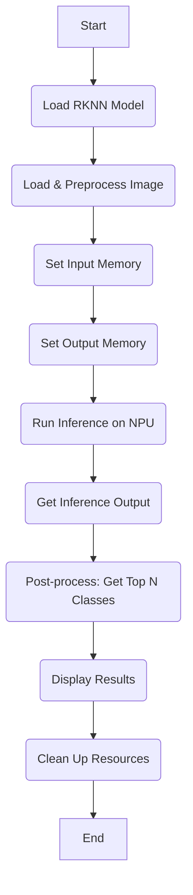
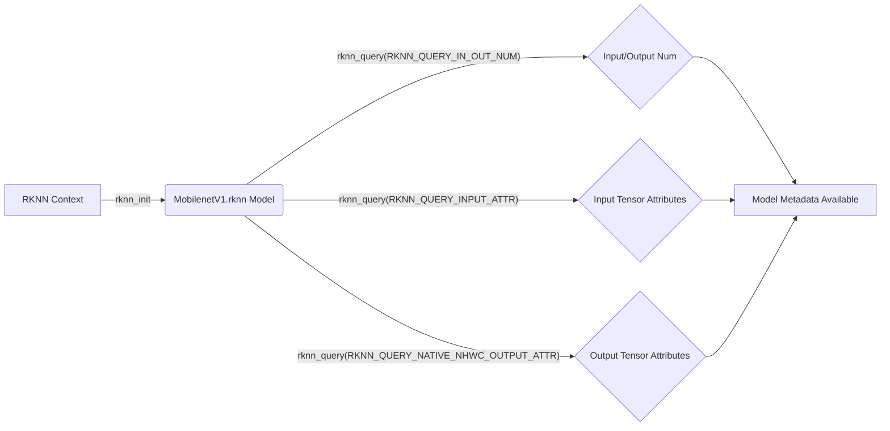
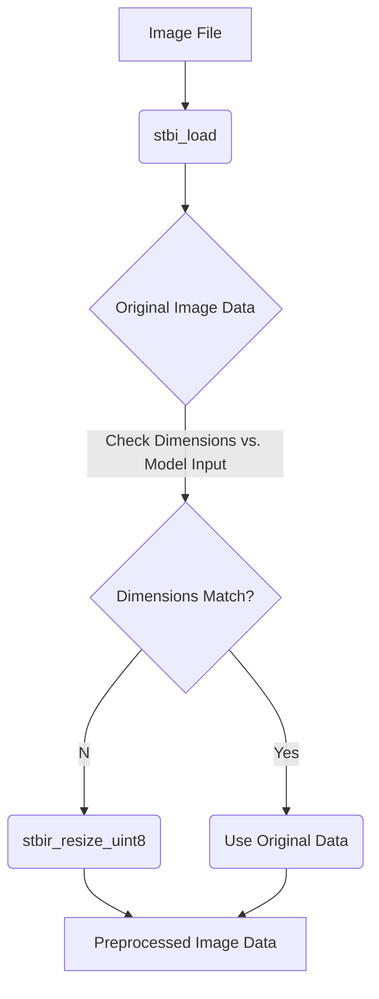

# Unlocking On-Device AI: Image Classification on the Luckfox Ultra with MobileNet

The world of embedded AI is rapidly expanding, bringing powerful machine learning capabilities to compact, low-power devices. It's amazing how much intelligence we can now pack into something as small as the Luckfox Ultra. The Ultra is a cost effective highly integrated edge AI computing platform from Luckfox. In this article, we'll explore a practical example: performing image classification using a pre-trained MobileNetV1 model on this neat little device.

## The Luckfox Ultra and MobileNet

The Luckfox Ultra (based on Rockchip's RV1106/RV1103 SoC) is specifically designed for edge AI. It has a dedicated Neural Processing Unit (NPU) built right in, which is like a specialized co-processor for AI tasks. This allows AI models to run directly on the device, minimizing latency (things happen super fast!) and reducing reliance on distant cloud servers. It's all about keeping the intelligence close to where the action is.

MobileNetV1 is a family of incredibly efficient convolutional neural networks. They were literally designed with mobile and embedded vision applications in mind. Their lightweight architecture makes them ideal for deployment on resource-constrained devices like the Luckfox Ultra, all while still delivering strong performance on tasks like image classification.

## The Classification Workflow: A High-Level Overview

At its core, the image classification example follows a standard AI inference pipeline. It's a little like a factory assembly line for understanding images:

- Model Loading: First, the specialized "knowledge" of the pre-trained MobileNetV1 model (in a format called .rknn) is loaded onto the device.
- Image Preprocessing: Next, an input image (say, a photo of a dog or a cat) is loaded and carefully prepared, usually by resizing it to match the model's exact expectations.
- Inference: The prepared image is fed into the NPU via the RKNN API for the actual classification.
- Post-processing: Finally, the raw numerical output from the model is interpreted. This is where we figure out which object the model thinks is most likely in the image.



## Exploring the Code

The provided C code gives us a hands-on look at this workflow. We'll focus on the critical functions and data structures that make it all possible.

### Model Loading and Querying

The RKNN API is our gateway to interacting with the NPU. It's how we tell the Luckfox Ultra's AI hardware what to do.

```C

// Init rknn from model path
int ret = rknn_init(&ctx, model_path, 0, 0, NULL);
if (ret < 0) {
    printf("rknn_init fail! ret=%d\n", ret);
    return -1;
}

// Get Model Input Output Info
rknn_input_output_num io_num;
ret = rknn_query(ctx, RKNN_QUERY_IN_OUT_NUM, &io_num, sizeof(io_num));
// ... error handling ...

// Query input and output tensor attributes
rknn_tensor_attr input_attrs[io_num.n_input];
rknn_tensor_attr output_attrs[io_num.n_output];
// ... query details for each tensor ...
This section does a couple of vital things: it initializes the RKNN context, essentially waking up the NPU and loading the .rknn model's "brain." Then, it queries the model. This is like asking the model, "Hey, what kind of data do you expect as input? And what kind of data will you give me back as output?" Understanding these input and output requirements (number of tensors, their dimensions, data types, and any quantization parameters) is super important for preparing data correctly.

```



### Image Loading and Preprocessing

The load_image function is responsible for getting the image ready for the model. It reads the image file and resizes it to the exact dimensions the model expects. For MobileNetV1, this often means a 224x224 pixel image with 3 color channels (RGB).

```C

static unsigned char *load_image(const char *image_path, rknn_tensor_attr *input_attr) {
    // ... STB Image loading ...
    // ... Resizing with stbir_resize_uint8 if dimensions don't match ...
}

// In main:
unsigned char *input_data = load_image(input_path, &input_attrs[0]);

```

The stb_image and stb_image_resize libraries are incredibly handy here, simplifying image loading and resizing. It's a very common step for almost any vision model, as models are finicky about the exact size of images they process.



### Data Transfer and Inference Execution

Once the image is beautifully preprocessed, it needs to be transferred to the NPU's special memory. The RKNN API helps here with rknn_create_mem to allocate this NPU-accessible memory, and rknn_set_io_mem to link this memory to the model's input and output "ports."

```C

// Create input tensor memory
rknn_tensor_mem *input_mems[1];
input_mems[0] = rknn_create_mem(ctx, input_attrs[0].size_with_stride);
// ... memcpy input_data to input_mems[0]->virt_addr ...

// Set input tensor memory
ret = rknn_set_io_mem(ctx, input_mems[0], &input_attrs[0]);

// Create output tensor memory (and set type for de-quantization)
rknn_tensor_mem *output_mems[io_num.n_output];
for (uint32_t i = 0; i < io_num.n_output; ++i) {
    if (output_attrs[i].type == RKNN_TENSOR_INT8) {
        output_mems[i] = rknn_create_mem(ctx, output_attrs[i].n_elems * sizeof(int8_t));
    } else {
        output_mems[i] = rknn_create_mem(ctx, output_attrs[i].n_elems * sizeof(float));
    }
    // ... error handling ...
    ret = rknn_set_io_mem(ctx, output_mems[i], &output_attrs[i]);
    // ... error handling ...
}

// Run inference
ret = rknn_run(ctx, NULL);

```

A really important detail here, especially for quantized models like INT8 MobileNetV1, is how we handle the output data type. The model spits out INT8 values, which are essentially compressed numbers. These need to be de-quantized back into regular floating-point numbers to become meaningful scores. The code intelligently checks the model's native output tensor type (output_attrs[i].type). It either relies on the RKNN runtime to de-quantize automatically (if we tell it to expect RKNN_TENSOR_FLOAT32 with rknn_set_io_mem) or prepares for us to do it manually.

If the model's output type is INT8 (which our debug logs confirmed), you absolutely must ensure these values are correctly converted to float using the scale and zp (zero point) parameters provided by the model's rknn_tensor_attr. The rknn_GetTopN_int8 function is designed to do exactly this: float prob = (pProb[i] - zp) \* scale;. Getting this step right is often the key to moving from all-zero outputs to meaningful predictions!

```mermaid

graph TD
    A[Preprocessed Image Data (CPU)] --> B(rknn_create_mem);
    B --> C[Input Tensor Memory (NPU-accessible)];
    C --memcpy--> D[Image Data in NPU Memory];
    D --rknn_set_io_mem--> E[RKNN Model Input];
    F[RKNN Model Output] --rknn_create_mem--> G[Output Tensor Memory (NPU-accessible)];
    G --rknn_set_io_mem--> H[Bind Output Memory];
    E & H --rknn_run--> I(NPU Executes Inference);
    I --> J[Raw Output in Output Tensor Memory];
```

## Post-processing: Getting Top N Results

The raw numerical output from the NPU is a long list of scores, one for each possible class the model knows about. Our goal is to find the classes with the highest scores – these are the model's top predictions! The rknn_GetTopN (or rknn_GetTopN_int8) function sorts through these scores and gracefully returns the top 5 predicted classes along with their confidence scores.

```C

// ... after rknn_run ...
uint32_t topNum = 5;
for (uint32_t i = 0; i < io_num.n_output; i++) {
    uint32_t MaxClass[topNum];
    float fMaxProb[topNum];
    uint32_t sz = output_attrs[i].n_elems;

    // Conditionally use the correct GetTopN function based on output type
    if (output_attrs[i].type == RKNN_TENSOR_INT8) {
        int8_t *buffer_int8 = (int8_t *)output_mems[i]->virt_addr;
        rknn_GetTopN_int8(buffer_int8, output_attrs[i].scale, output_attrs[i].zp, fMaxProb, MaxClass, sz, topNum);
    } else {
        float *buffer_float = (float *)output_mems[i]->virt_addr;
        rknn_GetTopN(buffer_float, fMaxProb, MaxClass, sz, topNum);
    }

    printf("---- Top%d ----\n", top_count);
    for (int j = 0; j < top_count; j++) {
        printf("%8.6f - %d\n", fMaxProb[j], MaxClass[j]);
        // To show actual class names, load a synset.txt (label map) and print here
    }
}
```

```bash
./run_demo.sh
[DEBUG] Model initialization status: SUCCESS
rknn_api/rknnrt version: 1.6.0 (2de554906@2024-01-17T14:53:41), driver version: 0.9.2
model input num: 1, output num: 1
[DEBUG] Model input/output numbers seem valid.
input tensors:
  index=0, name=input:0, n_dims=4, dims=[1, 224, 224, 3], n_elems=150528, size=150528, fmt=NHWC, type=UINT8, qnt_type=AFFINE, zp=0, scale=0.007812
[DEBUG] Input tensor 0 attributes dumped.
output tensors:
  index=0, name=MobilenetV1/Logits/SpatialSqueeze:0, n_dims=4, dims=[1, 1, 1, 1008], n_elems=1008, size=1008, fmt=NHWC, type=INT8, qnt_type=AFFINE, zp=-53, scale=0.108075
[DEBUG] Output tensor 0 attributes dumped.
custom string:
[DEBUG] Loaded image properties:
[DEBUG] Original image dimensions: 224x224x3
[DEBUG] Required image dimensions (from model input attr): 224x224x3
[DEBUG] Image loaded and processed successfully.
[DEBUG] Input data copied directly (width == stride).
[DEBUG] Input tensor memory set successfully.
[DEBUG] Output tensor 0 memory set successfully.
Begin perf ...
   0: Elapse Time = 8.87ms, FPS = 112.79
[DEBUG] RKNN run for loop 0 completed.
[DEBUG] First few values of output tensor 0: -3.999451, -2.053772, -4.648010...
19.456787 - 156 - Blenheim spaniel
16.646362 - 155 - Shih-Tzu
13.727844 - 205 - flat-coated retriever
12.430725 - 284 - Siamese cat, Siamese
10.376953 - 260 - chow, chow chow
[DEBUG] RKNN input and output memories destroyed.
[DEBUG] RKNN context destroyed.
[DEBUG] Input image data freed.
[DEBUG] Model initialization status: SUCCESS
rknn_api/rknnrt version: 1.6.0 (2de554906@2024-01-17T14:53:41), driver version: 0.9.2
model input num: 1, output num: 1
[DEBUG] Model input/output numbers seem valid.
input tensors:
  index=0, name=input:0, n_dims=4, dims=[1, 224, 224, 3], n_elems=150528, size=150528, fmt=NHWC, type=UINT8, qnt_type=AFFINE, zp=0, scale=0.007812
[DEBUG] Input tensor 0 attributes dumped.
output tensors:
  index=0, name=MobilenetV1/Logits/SpatialSqueeze:0, n_dims=4, dims=[1, 1, 1, 1008], n_elems=1008, size=1008, fmt=NHWC, type=INT8, qnt_type=AFFINE, zp=-53, scale=0.108075
[DEBUG] Output tensor 0 attributes dumped.
custom string:
[DEBUG] Loaded image properties:
[DEBUG] Original image dimensions: 224x224x3
[DEBUG] Required image dimensions (from model input attr): 224x224x3
[DEBUG] Image loaded and processed successfully.
[DEBUG] Input data copied directly (width == stride).
[DEBUG] Input tensor memory set successfully.
[DEBUG] Output tensor 0 memory set successfully.
Begin perf ...
   0: Elapse Time = 10.02ms, FPS = 99.76
[DEBUG] RKNN run for loop 0 completed.
[DEBUG] First few values of output tensor 0: -3.458984, -2.486145, 0.108093...
12.322632 - 283 - Persian cat
11.565979 - 282 - tiger cat
11.565979 - 286 - cougar, puma, catamount, mountain lion, painter, panther, Felis concolor
10.052673 - 278 - kit fox, Vulpes macrotis
9.728394 - 279 - Arctic fox, white fox, Alopex lagopus
[DEBUG] RKNN input and output memories destroyed.
[DEBUG] RKNN context destroyed.
[DEBUG] Input image data freed.

```

When you see output like 12.322632 - 283, it means the model is pretty confident about class 283, giving it a score of 12.322632. But what is class 283? To translate that number into something meaningful (like "Persian cat"), you absolutely need a label map file (often called synset.txt for ImageNet models). This simple file lists the human-readable names for each class index, turning numbers into understandable categories!

```mermaid

graph TD
    A[Raw Output Scores (NPU Memory)] --> B{Check Output Type};
    B --INT8--> C(rknn_GetTopN_int8);
    B --FLOAT32--> D(rknn_GetTopN);
    C --> E[De-quantized Scores];
    D --> E;
    E --> F(Sort by Score);
    F --> G[Top N Class Indices & Scores];
    G --> H(Lookup Class Names from Label Map);
    H --> I[Human-Readable Predictions];
```

## Conclusion

This example demonstrates the power and relative simplicity of deploying MobileNetV1 for image classification on the Luckfox Ultra. By understanding these core steps – getting the model ready, preparing your image, offloading the work to the NPU, and then interpreting the results – we are well on your way to creating a basic pipeline that we can use for a whole host of on-device AI applications.

The Luckfox Ultra's NPU, combined with optimized models like MobileNet, opens up fascinating possibilities for creating smart, responsive, and autonomous systems right at the edge.
