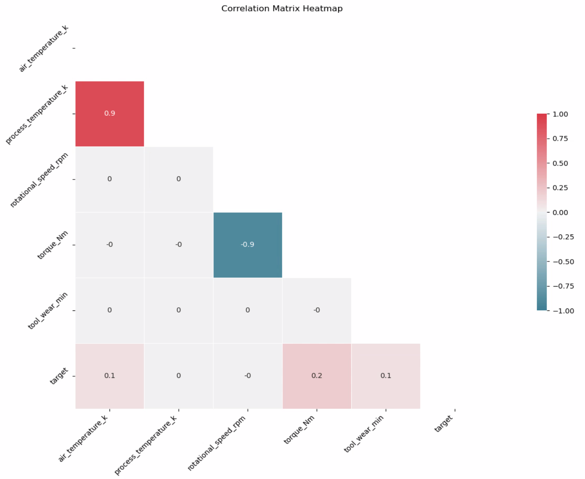

# Data Analytics


## Measurement

### Variance

The variance is a squared measure of how much each individual process rotational speed value deviates from the mean.The larger the variance, the more spread out the data points are from the mean. The unit of variance is squared, so it doesn't have the same unit as the original data. If you want a measure in the same unit as your original data, you can take the square root of the variance to get the standard deviation.

```math
\text{variance} = \frac{\sum_{i=1}^{n} (x_i - \bar{x})^2}{n-1}
```

### Standard Deviation

The standard deviation is a statistical measure of the amount of variation or dispersion in a set of values. It quantifies how much individual data points differ from the mean (average) of the data set. A low standard deviation indicates that the data points tend to be close to the mean, while a high standard deviation indicates that the data points are spread out over a wider range.

```math
\sigma = \sqrt{\frac{\sum_{i=1}^{n} (x_i - \bar{x})^2}{n-1}} 
```

### Z-Score

A Z-score is a statistical measure that describes a value's relationship to the mean of a group of values. It is measured in terms of standard deviations from the mean. A Z-score of 0 indicates that the data point's score is identical to the mean score, a Z-score of 1.0 indicates a value that is one standard deviation from the mean, and so on. The Z-Score can be useful in determining data spikes.

```math
Z = \frac{(X - \mu)}{\sigma} 
```

### Min/Max

The Minimum and maximum values can emphasize outliers. This can be useful in determining anomalies in a dataset.


### Tumbling or Rolling Window

Tumbling window functions group data streams into time segments. Tumbling windows means that the window does not repeat or overlap data from one segment waterfall into the next.

### Hopping Windows

Hopping windows are tumbling windows that overlap. They allow you to set specific commands and conditions, such as every 5 minutes, give me the readings over the last 10 minutes. To make a hopping window the same as a tumbling window, you would make the hop size the same as the window size.

### Sliding Windows

There are two types of sliding windows. Time Sliding triggers at regular interval and Eviction Sliding triggers on a count.


## Using Charts

### Bar Charts

Bar charts are commonly used in various circumstances to visually represent and compare categorical data. Bar charts can have many items simply because of the page layout. Column and bar charts can also show change over time. Bar charts can show the distribution of data across different categories. This is useful when you want to see how data points are spread among different groups. They can also be used to represent data over time, especially when the time intervals are discrete (e.g., days, months). Each bar represents the value of the data at a specific time point. Bar charts are useful for displaying the frequency distribution of categorical data. For example, the number of occurrences of each category in a dataset.

### Scatter Plot

A scatter plot is a type of data visualization that displays individual data points on a two-dimensional graph. Each point on the plot represents the values of two variables, with one variable plotted on the x-axis and the other on the y-axis. Scatter plots are useful for visualizing the relationship between two continuous variables, identifying patterns, and detecting outliers.

### Bubble chart


The relationship between torque and speed in a system is often described by the power equation:

```math
P = \text{Torque} \times \text{Angular Speed}
```

- P is the power,
- Torque is the applied force that can cause an object to rotate,
- Angular Speed is the rate at which the object rotates.

The relationship can be rearranged to show the inverse relationship between torque and speed for a constant power:

```math
\text{Torque} = \frac{P}{\text{Angular Speed}}
```

```math
\text{Angular Speed} = \frac{P}{\text{Torque}}
```

This indicates that as torque increases, angular speed decreases, and vice versa, to maintain constant power. This relationship is commonly observed in rotational systems and machinery.


### Q Plot

A Q-Q (Quantile-Quantile) plot is a graphical tool used to assess whether a dataset follows a particular theoretical distribution. Checking for a normal distribution is a common case. In a Q-Q plot, the x-axis represents the theoretical quantiles from a specified distribution, and the y-axis represents the observed quantiles from the dataset.

In this case, we observe an S-shaped curve at the start and finish of the Q-Q plot, it suggests that the tool wear data may deviate from a perfectly normal distribution at the tails. Specifically:

__S-Curve at the Start__: If the left tail (start) of the curve deviates downward, it suggests that the tool wear values are lower than expected under a normal distribution.

__S-Curve at the Finish__: If the right tail (finish) of the curve deviates upward, it suggests that the tool wear values are higher than expected under a normal distribution.

Interactions between multiple variables in a mechanical process can contribute to complex data distributions. Some mechanical processes may have threshold effects or limits that can introduce non-normal behavior in the data.


### Frequency Distribution with Normal Distribution Curve Superimposed


### Heatmap

A heatmap is a graphical representation of data where values in a matrix are represented as colors. It's a way of visualizing complex data in a two-dimensional space, and it is particularly useful for revealing patterns and trends.





### Co-variance

Covariance measures how much two variables change together. If the covariance is positive, it indicates that when one variable is above its mean, the other variable tends to be above its mean as well. If the covariance is negative, it indicates an inverse relationship, meaning that when one variable is above its mean, the other tends to be below its mean.

```math
\text{cov}(X, Y) = \frac{\sum_{i=1}^{n} (X_i - \bar{X})(Y_i - \bar{Y})}{n-1} 
```


Consider the example:


| A   | B  |  C |
| ---- | ----- | ----|
| 1.0  | 4.0 | 0.5 |
| 2.0  | 5.0 | 0.8 |
| 3.0  | 6.0 | 1.0 |

So, n = 3 because we have tree rows of data. We calculate the means of the columns A,B and C as 2,5 and 0.77. We can know calculate the co-variance for each row.

We first calculate the co-variance between A and B:


```math
\text{cov}(A, B) = \frac{\sum_{i=1}^{3} (A_i - \bar{A})(B_i - \bar{B})}{3-1}
```

This becomes:

```math
= \frac{(1-2) \cdot (4-5) + (2-2) \cdot (5-5) + (3-2) \cdot (6-5)}{2}
```

And simplifies to this:

```math
= \frac{(-1) \cdot (-1) + (0) \cdot (0) + (1) \cdot (1)}{2}
```

Giving us a value for the co-variance between A and B.

```math
= \frac{1 + 0 + 1}{2} = 1
```


Similarly, for A to C

```math
\text{cov}(A, C) = \frac{\sum_{i=1}^{3} (A_i - \bar{A})(C_i - \bar{C})}{3-1}
```

This becomes:

```math
= \frac{(1-2) \cdot (0.5-0.77) + (2-2) \cdot (0.8-0.77) + (3-2) \cdot (1.0-0.77)}{2}
```

And simplifies to this:

```math
= \frac{(-1) \cdot (-0.27) + (0) \cdot (0.03) + (1) \cdot (0.23)}{2}
```

Giving us a value for the co-variance between A and C.

```math
= \frac{0.27 + 0.23}{2} = 0.25
```

And finally, B to C

```math
\text{cov}(B, C) = \frac{\sum_{i=1}^{3} (B_i - \bar{B})(C_i - \bar{C})}{3-1}
```

This becomes:

```math
= \frac{(4-5) \cdot (0.5-0.77) + (5-5) \cdot (0.8-0.77) + (6-5) \cdot (1.0-0.77)}{2}
```

And simplifies to this:

```math
= \frac{(-1) \cdot (-0.27) + (0) \cdot (0.03) + (1) \cdot (0.23)}{2}
```

Giving us a value for the co-variance between B and C.

```math
= \frac{0.27 + 0.23}{2} = 0.25
```

Covariance is sensitive to the scale of the variables, and its interpretation can be challenging when dealing with variables on different scales. To overcome this, the correlation coefficient is often used, as it standardizes the measure to be between -1 and 1, providing a normalized measure of the strength and direction of the linear relationship between two variables. The correlation coefficient is calculated as the covariance divided by the product of the standard deviations of the variables.

```math
r = \frac{\text{cov}(X, Y)}{s_X \cdot s_Y}
```

- where cov(X,Y) is the covariance between variables X and Y.
- where sx and sy are standard deviations of X and Y respectively.

A negative covariance indicates an inverse relationship: when one variable increases, the other tends to decrease, and vice versa. A negative covariance between rotational speed and tool wear suggests that, on average, when the rotational speed is higher than its mean, there is a tendency for process rotational speed to be higher than its mean, and when the rotational speed is lower than its mean, there is a tendency for process rotational speed  to be lower.


We can use a heatmap to plot the correlation co-efficient for the principle features of our data. 


### Anomaly detection

Anomaly detection is a technique used in data analysis and machine learning to identify patterns, events, or observations that deviate significantly from the expected behavior in a dataset. These deviations are often referred to as "anomalies" or "outliers." Anomalies can represent unusual or suspicious activities, errors, or events that are different from the norm.

Anomaly detection in machine learning can be unsupervised, supervised, or semi-supervised. We can start by using an unsupervised machine learning algorithm (like K-means) to identify data clusters or patterns.

The data may represent various states of the system under examination. These states may be resting states, in-use states, cold states, or one of a number of failed states.

### Looking for evidence of clustering in the data

#### Tightness of Clusters

Look for clusters where data points within the same cluster are closely packed together. Tight and compact clusters are indicative of well-defined groups.

#### Separation Between Clusters

Check for clear separation between different clusters. Ideally, there should be noticeable gaps or boundaries between clusters, indicating that different groups are distinct from each other.

#### Centroid Locations

Examine the locations of cluster centroids. The centroids represent the mean or center of each cluster. Well-separated and distinct centroids contribute to evidence of meaningful clustering.

#### K Means

K-means is a popular and widely used clustering algorithm in machine learning and data analysis. It is an unsupervised learning algorithm designed to partition a dataset into K distinct, non-overlapping subsets (clusters), where each data point belongs to only one cluster. The algorithm seeks to minimize the sum of squared distances between data points and the centroid of their assigned cluster.


### Looking for Outliers in Data

Identifying outliers in our data is very important as they represent bad sensor placement, or a number of other issues. We can view outliers by looking at values that fall more than three standard deviations from the mean of our data.

### Identifying and Removing Noise in Data

In the context of feature data, "noise" typically refers to random variations or fluctuations in the data that are not attributed to the underlying patterns or relationships of interest. Noise can arise from various sources, including measurement errors, data collection artifacts, or inherent variability in the system being observed.

When we plot graphs to show the noise in feature data, we are often looking for patterns or irregularities in the data that are not part of the expected trends or relationships. There are a number of ways to interpret noise in feature data graphs:

#### Irregular Peaks or Valleys

If we observe irregular peaks or valleys in the data that do not align with the expected patterns, these could be indicative of noise.

#### Sudden Jumps or Drops

Abrupt and unexpected changes in the data that do not follow the overall trend might be considered noise. Such variations can be indicative of measurement errors or external factors influencing the data.

#### High-Frequency Fluctuations

High-frequency oscillations or fluctuations that are not part of the underlying signal may be considered noise. These can be particularly relevant in time-series data.

#### Outliers

Outliers, which are data points significantly different from the rest of the dataset, are a common form of noise. Identifying and understanding the cause of outliers can provide insights into the data quality.

#### Inconsistencies Across Features

If noise appears consistently across multiple features, it might be an indication of systematic errors or issues in the data collection process.

#### Visual Inspection

A visual inspection of the graphs can reveal unexpected patterns or irregularities that may be indicative of noise. Look for patterns that don't align with the overall structure of the data.

## Strategies for Predictive Maintenance


### Measuring Predictive Accuracy using a Decision Tree Classifier

A decision tree classifier is a popular machine learning algorithm used for both classification and regression tasks. It works by recursively partitioning the dataset into subsets based on the values of input features, creating a tree-like structure of decisions. Each node in the tree represents a decision based on a specific feature, and each branch represents the possible outcomes of that decision. The leaves of the tree represent the final predicted class or value.

Decision tree classifiers are easy to understand and interpret visually. They require little data preprocessing (e.g., no need for feature scaling). They can handle both numerical and categorical data and they automatically handles feature interactions. However; they are prone to over-fitting, especially with deep trees and they can also be sensitive to noisy data. Decision trees are often used in ensemble methods like Random Forests and Gradient Boosting to improve performance and robustness.


#### Applying a Decision Tree Classifier to our data set

```txt
Accuracy: 0.9795
Confusion Matrix:
[[1914   25]
 [  16   45]]

Confusion Matrix:

True Positives (TP): 45 - The model correctly predicted 45 instances of failure.
True Negatives (TN): 1914 - The model correctly predicted 1914 instances of non-failure.
False Positives (FP): 25 - The model incorrectly predicted 25 instances as failure when they were not.
False Negatives (FN): 16 - The model incorrectly predicted 16 instances as non-failure when they were.

Classification Report:
              precision    recall  f1-score   support

           0       0.99      0.99      0.99      1939
           1       0.64      0.74      0.69        61

    accuracy                           0.98      2000
   macro avg       0.82      0.86      0.84      2000
weighted avg       0.98      0.98      0.98      2000
```

##### Classification Report explained

__Precision__

Precision is the ratio of true positives to the sum of true positives and false positives. In our case, the precision for class 0 (non-failure) is 0.99, meaning that when the model predicts non-failure, it is correct about 99% of the time.

```math
Precision =  \text{Precision} = \frac{TP}{TP + FP} 
```

The precision for class 1 (failure) is 0.64, meaning that when the model predicts failure, it is correct about 64% of the time.

__Recall__

Recall (Sensitivity): Recall is the ratio of true positives to the sum of true positives and false negatives.
  
```math
Recall (Sensitivity or True Positive Rate) =  \text{Recall} = \frac{TP}{TP + FN} 
```

The recall for class 1 is 0.74, indicating that the model captures 74% of the actual failures.

__F1-score__

The F1-score is the harmonic mean (see below) of precision and recall. It provides a balance between precision and recall.

```math
F1 Score =  \text{F1-score} = 2 \times \frac{\text{Precision} \times \text{Recall}}{\text{Precision} + \text{Recall}} 
```

The F1-score for class 1 is 0.69.

__Support__

The number of actual occurrences of the class in the specified dataset.

__Macro Avg__

The average of precision, recall, and F1-score for both classes, without considering class imbalance. In our case, the macro average F1-score is 0.84.

__Accuracy__

This is a performance metric that measures the overall correctness of predictions made by a classification model. It is calculated as the ratio of the number of correct predictions (both true positives and true negatives) to the total number of predictions. The accuracy is often expressed as a percentage.


```math
Accuracy =  \text{Accuracy} = \frac{TP + TN}{TP + FP + FN + TN} 
```

__Weighted Avg__

The average of precision, recall, and F1-score, weighted by the number of samples in each class. This is useful when there is an imbalance in the number of samples between classes. In your case, the weighted average F1-score is 0.98.

In summary, this model has a high overall accuracy, but it's essential to consider precision, recall, and F1-score, especially for the class representing failure, to understand the performance of the model in predicting failures accurately and avoiding false positives/negatives.

#### Note on Confusion Matrix

A confusion matrix is a table that is often used to describe the performance of a classification model on a set of data for which the true values are known. It is a way to visualize and understand the performance of a machine learning model, especially in binary classification problems.

In a binary classification scenario, the confusion matrix has four components:

True Positives (TP): This is the number of instances where the model correctly predicts the positive class (e.g., the model correctly identifies a patient as having a disease).

True Negatives (TN): This is the number of instances where the model correctly predicts the negative class (e.g., the model correctly identifies a healthy patient as not having the disease).

False Positives (FP): Also known as Type I error, this is the number of instances where the model incorrectly predicts the positive class (e.g., the model predicts a healthy patient as having the disease).

False Negatives (FN): Also known as Type II error, this is the number of instances where the model incorrectly predicts the negative class (e.g., the model predicts a patient with the disease as healthy).

```math

\begin{array}{cc}
& \text{Actual Positive} & \text{Actual Negative} \\
\text{Predicted Positive} & \text{True Positives (TP)} & \text{False Positives (FP)} \\
\text{Predicted Negative} & \text{False Negatives (FN)} & \text{True Negatives (TN)} \\
\end{array}

```

__True Negative Rate__

```math
Specificity (True Negative Rate) =  \text{Specificity} = \frac{TN}{TN + FP} 
```

__True Positive  Rate__

```math
 TPR = \frac{TP}{TP + FN} 
```

#### Note on the Harmonic Mean

The harmonic mean is calculated by dividing the number of observations by the sum of the reciprocals of the values. Unlike the arithmetic mean, the harmonic mean gives more weight to smaller values in the dataset. If any value in the dataset is zero, the harmonic mean is undefined.

The harmonic mean is particularly useful in situations where rates are involved, such as speed, because it provides a way to average rates of movement or rates of occurrence. It tends to be less influenced by extremely large values compared to the arithmetic mean.

```math
 H = \frac{n}{\frac{1}{x_1} + \frac{1}{x_2} + \ldots + \frac{1}{x_n}} 
```

### Using XGBoost for Prediction


XGBoost (eXtreme Gradient Boosting) is a powerful and popular machine learning algorithm that falls under the category of ensemble learning. It is particularly well-suited for regression and classification problems.

In this example we are adapting it to predict the need for preventative maintenance.

#### Mean Percentage Error (MPE)

```math
 MPE = \frac{1}{n} \sum_{i=1}^{n} \left( \frac{y_{\text{true}, i} - y_{\text{pred}, i}}{y_{\text{true}, i}} \right) \times 100 
```

In this formula:

- n is the number of samples.
- y_true s the true value.
- y_pred   is the predicted value.

#### Mean Squared Error (MSE)

```math
MSE = (1/n) Σ (y_true - y_pred)^2
```