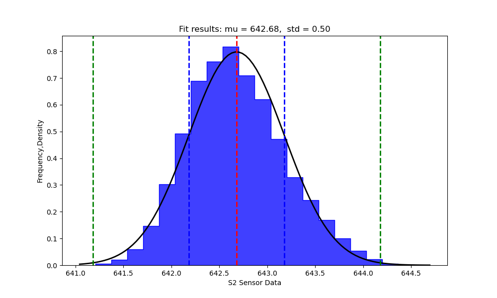
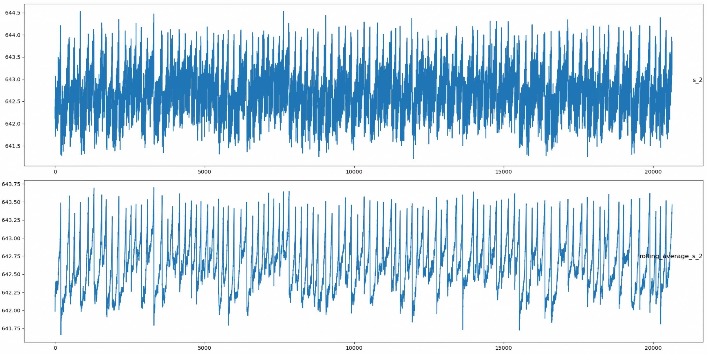
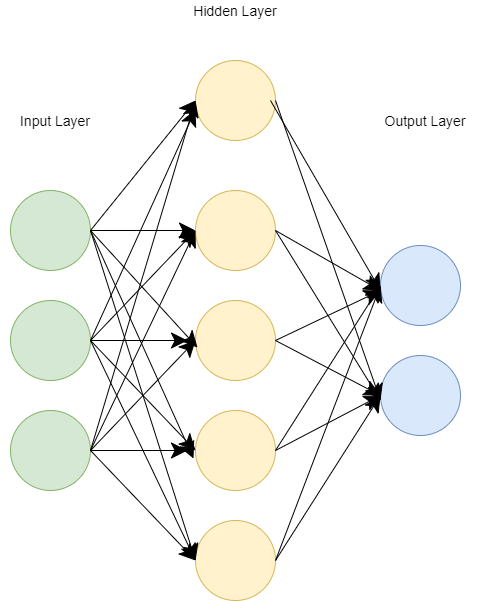

# Embedded AI systems

## Abstract

Embedded artificial intelligence (AI) stands at the forefront of technological innovation, presenting novel opportunities for cost-effective and energy-efficient AI solutions that extend beyond the capabilities of cloud-based AI technologies. This article is part of a series that explores the rapidly growing field of embedded AI.

Devices targeting Edge AI are set to experience exponential growth within the chip market. By 2024, an estimated 1.5 billion edge AI chips are anticipated to be sold, indicating a substantial surge in demand and deployment.

## Introduction

The evolution of embedded AI introduces a paradigm shift, necessitating expertise that transcends traditional embedded systems, data science, and machine learning (ML). This technology demands a practical understanding of devices, sensors, and advanced real-time signal processing techniques. Whether dealing with video, audio, motion, or other signals, embedded AI's distinctive characteristics require a unique skill set for effective implementation.

## Embedded AI Landscape

At its core, embedded AI is deeply intertwined with sensors and data. The transformative potential of embedded AI lies in the adept extraction of meaningful information from diverse datasets. This article delves into the pivotal role of understanding data extraction techniques and explores how the predictive prowess of machine learning algorithms can be harnessed to process this data. The focus is on addressing a spectrum of real-world challenges through the application of embedded AI methodologies.


## What Can We Learn From Data?

For the purpose of illustration we will use the [NASA Turbofan Jet Engine Data Set](https://www.kaggle.com/datasets/behrad3d/nasa-cmaps). This data set is the Kaggle version of the very well known public data set for asset degradation modeling from NASA. It includes Run-to-Failure simulated data from turbo fan jet engines.

The data set has a number of operational settings and data from 26 sensors. We show an extract of this below in table 1. 

| unit number | time | in cycles | setting 1 | setting 2 | setting 3 | sensor 1 |  sensor 2 | .... | sensor 26 |
| ----- | ----- | ----- | ----- | ----- | ----- | ----- |  ----- | ----- | ----- |
| 1| 1| -0.0007| -0.0004| 100.0| 518.67| 641.82| 1589.70| | 23.4190| | 
| 1| 2| 0.0019| -0.0003| 100.0| 518.67| 642.15| 1591.82| | 23.4236| | 
| 1| 3| -0.0043| 0.0003| 100.0| 518.67| 642.35| 1587.99| | 23.3442| | 
| 1| 4| 0.0007| 0.0000| 100.0| 518.67| 642.35| 1582.79| | 23.3739| | 
| 1| 5| -0.0019| -0.0002| 100.0| 518.67| 642.37| 1582.85| | 23.4044| | 
| .....| .....| .....| .....| .....| ......| ......| ......| .....| 
| 1| 7| 0.0010| 0.0001| 100.0| 518.67| 642.48| 1592.32| | 23.3774| 

*Table 1: Extract from NASA Turbofan Jet Engine Data Set.*


## Preparing the Data

Out first task is to read in the dataset into a format we can work with. The original data exists as a sequence of space-separated columns. We will create a Pandas frame to hold the data. A Pandas DataFrame is a two-dimensional, tabular data structure with labeled axes (rows and columns). It is a primary data structure in the Pandas library, a popular Python library for data manipulation and analysis. The DataFrame can be thought of as a spreadsheet or SQL table, where data is organized in rows and columns.

```python

import pandas as pd

dir_path = './data/' # identify the directory path that holds the data

                 
# define column names for easy indexing
index_names = ['unit_nr', 'time_cycles']
setting_names = ['setting_1', 'setting_2', 'setting_3']
sensor_names = ['s_{}'.format(i) for i in range(1,22)] # this will label the sensor data as s_1, s_2 etc
col_names = index_names + setting_names + sensor_names # combine these into a single reference for the column names

# read data
train = pd.read_csv((dir_path+'train_FD001.txt'), sep='\s+', header=None, names=col_names)

```

Having imported the data we can then examine the data for sensor number two (s_2).

```txt
0        641.82
1        642.15
2        642.35
3        642.35
4        642.37
          ...  
20626    643.49
20627    643.54
20628    643.42
20629    643.23
```

## Basic Statistics

Pandas has a describe method which can give us very useful data about the sensor measurements.

```python
print(train["s_2"].describe().transpose())
```

```txt
Name: s_2, Length: 20631, dtype: float64
count    20631.000000
mean       642.680934
std          0.500053
min        641.210000
25%        642.325000
50%        642.640000
75%        643.000000
max        644.530000
```

We can see that the data has a mean value of __642.680934__ and a standard deviation of __0.500053__. We can also see the data for the first, second and third quartiles. The 25% value (__642.325000__) is the first quartile. This is the value below which 25% of the data falls. This offers us our first insight into the data our sensor is collecting.

## Visualizing and Testing Assumptions

Visualizing the data can tell us something about its shape and distribution.


*Figure 1: Visualizing Data*

However, we may often need to test assumptions about the data to determine if these assumptions are correct. We can, for example, test the data to see how closely it follows a normal distribution. 

```python
    test_statistic, p_value = shapiro(train["s_2"]) 
    print("Test Statistic:", test_statistic)
    print("P-value:", p_value) 
```


A Small P-value indicates strong evidence against the null hypothesis. In this case, the null hypothesis is that the sample comes from a normal distribution. 

For our sensor data we get the following values:

| Statistic | Value |
| ----- | ----- |
| Test Statistic | 0.9927533864974976 |
| P-value | 1.3491896278794517e-30 |

The extremely small p-value suggests that the data significantly deviates from a normal distribution. In other words, we have enough evidence to reject the hypothesis that the data is normally distributed.

One of the issues we often need to manage when dealing with sensor data is understanding the noise profile of the data. The first step in this analysis is to try and plot the data to see the visual profile of the data (see the top diagram in fiure 1 below).

If we examine our data from sensor 2 we can see there is a lot of variation and short term fluctuations. Looking at the data in this form it is difficult to see the underlying shape of the data.

```python
    values = train['s_2'] 
    i = 1
    plt.figure(figsize=(10, 20))
    plt.plot(values) # plot the actual data
    plt.title("S2", y=0.5, loc='right')
    i += 1
    plt.show()
```

A rolling average, also known as a moving average, is a statistical calculation used to analyze data points by creating a series of averages of different subsets of the full dataset. It can help in determining the amount of noise in readings from a sensor by smoothing out short-term fluctuations or random variations in the data, providing a clearer picture of the underlying trend or pattern.

We can apply this method to our sensor data to try to get a clearer image of the underlying shape and movement of the data.

```python
    values = train['rolling_average_s_2'] 
    i = 1
    plt.figure(figsize=(10, 20))
    plt.plot(values) # plot the actual data
    plt.title("S2 Rolling Average", y=0.5, loc='right')
    i += 1
    plt.show()
```

The rolling average can apply a smoothing effect, effectively smoothening the data by averaging out short-term fluctuations and random noise. This helps filter out high-frequency components in the signal, making it easier to identify the underlying trends or patterns.

The rolling average also enhances visualization. The smoothed data can be easier to visualize and interpret, especially when there are sudden spikes or drops in the original data that might be attributed to noise.

It becomes clearer to distinguish between actual signal variations (meaningful changes) and random noise. The noise tends to get averaged out, while the overall trajectory of the signal is more evident in the smoothed data.

Through experimentation, we can optimize the rolling window size to balance noise reduction with responsiveness to changes in the sensor readings.


[Full code for this analysis is available here](https://github.com/johnosbb/Artificial-intelligence/blob/main/IOT/preventative_maintenance/preventative_maintenance.py)


*Figure 2: Using Rolling Average to Remove Noise*

<!--  -->

 ## Scaling Data

 Now we scale the data. Each sensor of the dataset has a different scale. For example, the maximum value of S1 is 518 while the maximum value of S16 is 0.03. For that reason, we normalise the readings by converting all of the values to a range between 0 and 1. This normalisation allows each metric affect the model in a similar way. We will make use of the MinMaxScaler function from the sklearn library to adjust the scale.

```python
print(X_train)
print("Selection:\n")
print(X_train.iloc[:, 0:5])
scaler = MinMaxScaler(feature_range=(0, 1)) # The MinMaxScaler is a class from the sklearn.preprocessing module in scikit-learn. It is used to scale numerical features between a specified range. In this case, the range is set to (0, 1).
# Fit the scaler on the training data and transform both training and testing data
X_train.iloc[:, 0:5] = scaler.fit_transform(X_train.iloc[:, 0:5]) # selects all rows and columns from index 1 to 5 (inclusive) in the dataset'
X_test.iloc[:, 0:5] = scaler.transform(X_test.iloc[:, 0:5])
dim = X_train.shape[1]
print(X_train)
```
 
We can now begin to evaluate models that allows us explore the correlation between the sensors value and the probability of failure.

In the context of deep learning, a Sequential model is a linear stack of layers in which you build a neural network layer by layer, starting from the input layer and progressing through hidden layers until the output layer. Each layer in the Sequential model has weights that correspond to the layer that follows it.
The Sequential model is part of the Keras library, a high-level neural networks API that is now integrated into TensorFlow.


*Figure 3: Sequential Model*


in the model shown above data is fed from the input to each of the 32 input neurons. The neurons are connected through channels, with each channel assigned a numerical value known as a weight. The inputs are multiplied by the corresponding weight and their sum is sent as input to the neurons in the hidden layer.

Each of the neurons in the hidden layer is associated with a numerical value called the bias, which is added to the input sum. This value is then passed to a threshold function called the activation function. The activation function determines if
a neuron will get activated or not.

In this sequential model we used Leaky ReLU as the activation function for our first 2 layers. ReLU or Rectified Linear Unit is a popular activation function because it solves the vanishing gradient problem. The vanishing gradient problem occurs when these gradients become extremely small as they are propagated backward through the layers of the network.

The activated neuron passes its data to the next layer over the channels. This method allows the data to be propagated forward through the network. In the output layer, the neuron with the highest layer fires and determines the output.

