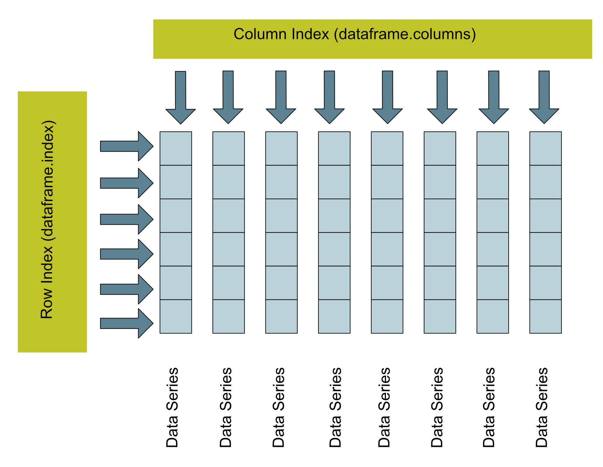
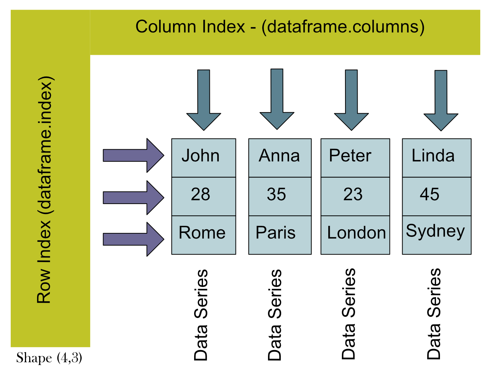
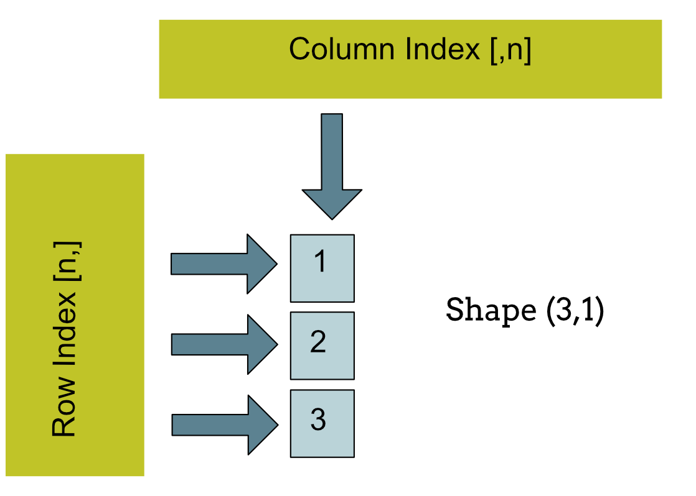
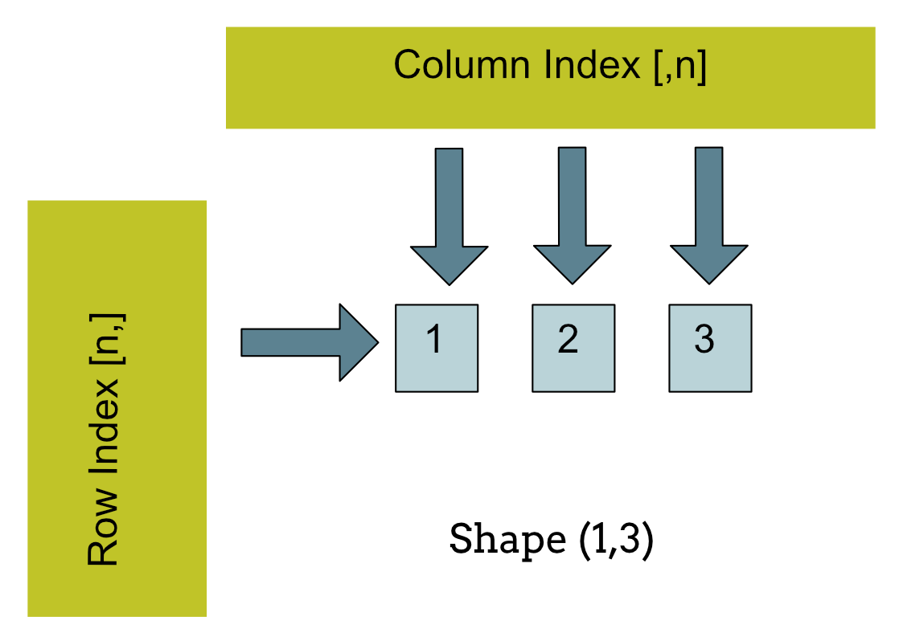
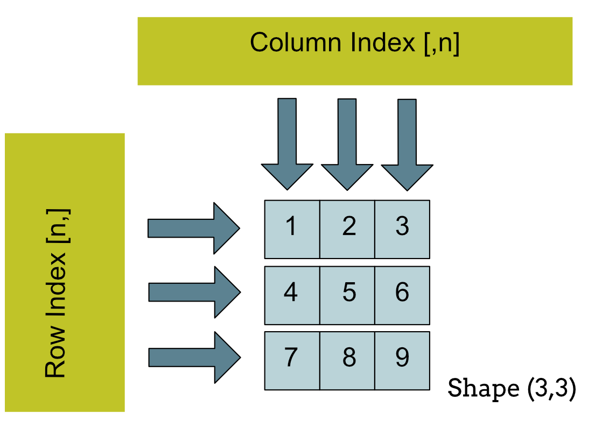
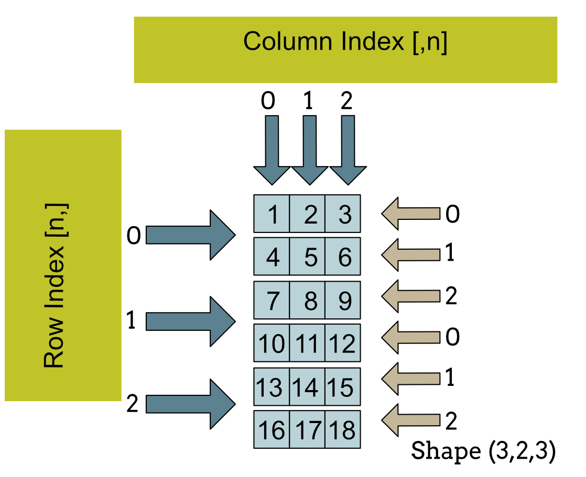
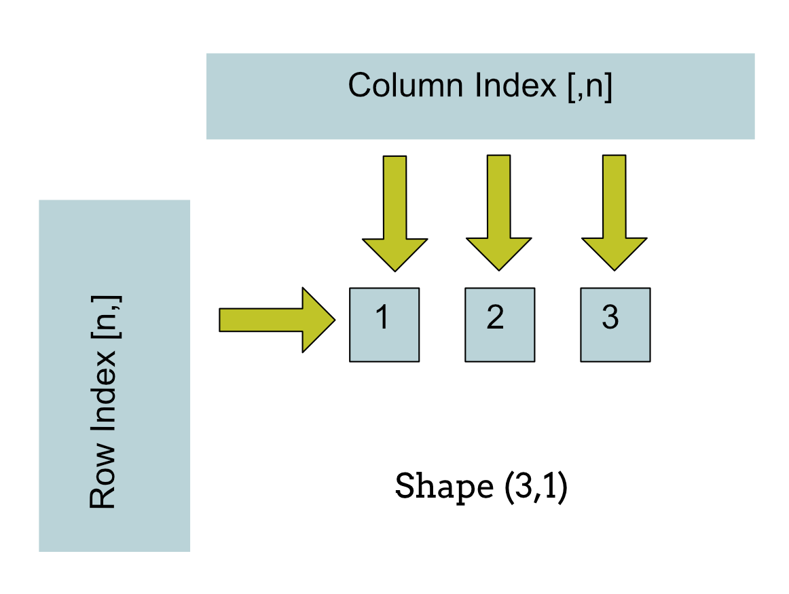

# Embedded AI systems Part 2

## Abstract

Embedded artificial intelligence (AI) is a burgeoning field that holds immense promise for revolutionizing various industries by bringing intelligence directly to devices. This article, the second in a series, delves deeper into the realm of embedded AI, exploring its significance, challenges, and potential applications.

## Introduction

Embedded AI represents a paradigm shift in the way we approach AI implementation, enabling intelligent decision-making at the edge, closer to where data is generated and action is required. To harness the full potential of embedded AI, efficient preprocessing of data into a format suitable for AI models is crucial. This article discusses the use of Python libraries like Pandas, Tensorflow, PyTorch and NumPy to preprocess data efficiently for embedded AI applications.

## Pandas

Pandas is an open-source Python library that provides high-level data structures and data analysis tools. It is widely used for data manipulation, analysis, and visualization tasks in data science and machine learning projects.

### Data Representation

At the core of Pandas is the **DataFrame:** A DataFrame is a two-dimensional labeled data structure with columns of potentially different types. It is part of the pandas library and is designed for handling tabular data. A DataFrame is specifically designed to be a two-dimensional labeled data structure. It cannot have more than two dimensions. Each column in a DataFrame represents a different variable, and each row represents a different observation. This tabular format makes it easy to organize, manipulate, and analyze data.



### Data Types

DataFrames can contain columns of different data types (e.g., integers, floats, strings, etc.). Each column in a DataFrame is essentially a pandas Series, which can have its own data type.

### Indexing and Labeling

DataFrames support both integer-based and label-based indexing. Columns and rows can have user-defined labels, making it easy to reference specific subsets of data using these labels. The row and column labels in a DataFrame can be accessed through the `index` and `columns` attributes, respectively. In pandas DataFrames, when using `.loc[]`, you first specify the row label and then the column label.

### Functionality

DataFrames offer a wide range of functionality for data manipulation and analysis, including data alignment, grouping, merging, reshaping, and more. They also support missing data handling and time series functionality.

- [Pandas DataFrame Cheatsheet](https://www.webpages.uidaho.edu/~stevel/cheatsheets/Pandas%20DataFrame%20Notes_12pages.pdf)

### Libraries

DataFrames are part of the pandas library, which is built on top of NumPy. pandas provides high-level data structures and functions designed for data analysis and manipulation.

### Examples

#### Creating a Dataframe.

```python
# Creating a DataFrame from a dictionary
data = {
    'Name': ['John', 'Anna', 'Peter', 'Linda'],
    'Age': [28, 35, 23, 45],
    'City': ['Rome', 'Paris', 'London', 'Sydney']
}

df = pd.DataFrame(data)

print(df)
```

```
    Name  Age    City
0   John   28    Rome
1   Anna   35   Paris
2  Peter   23  London
3  Linda   45  Sydney
```



The concept of shape is very important when dealing with different data formats. The dataframe above, for example, has a shape of (4,3).

#### Referencing Elements in the Dataset

**Note**: In pandas DataFrames, when using .loc[], you first specify the row label and then the column label.

```python
print(f"Element at '0', 'Name': {df.loc[0, 'Name']}")
print(f"Element at '0', 'Name': {df.loc[0, 'City']}")
print(f"Element at position (0, 1): {df.iloc[0, 1]}")
print(f"Element at position (2, 2): {df.iloc[2, 2]}")
```

```
Element at '0', 'Name': John
Element at '0', 'Name': Rome
Element at position (0, 1): 28
Element at position (2, 2): London
```

#### Selecting a Subset of a Dataframe

We can select subsets of a dataframe. In the following example we select columns 'A' and 'C' in all rows.

```python
import pandas as pd

# Example DataFrame
data = {
    'A': [1, 2, 3],
    'B': [4, 5, 6],
    'C': [7, 8, 9]
}
df = pd.DataFrame(data)

# Extracting a subset of columns
subset = df[['A', 'C']]  # Selecting columns 'A' and 'C'
```

We can also select a subset of a dataframe that consists of every second row.

```python
# Example DataFrame
data = {
    'A': [1, 2, 3, 4, 5],
    'B': [6, 7, 8, 9, 10],
    'C': [11, 12, 13, 14, 15]
}
df = pd.DataFrame(data)

# Selecting every second row
every_second_row = df.iloc[::2]

print(every_second_row)

```

## NumPy

NumPy is a fundamental Python library for numerical computing that provides support for large, multi-dimensional arrays and matrices, along with a collection of mathematical functions to operate on these arrays efficiently. It is an essential tool in the Python data science ecosystem and is widely used in various fields such as scientific computing, machine learning, and engineering.

### Data Representation

NumPy arrays are homogeneous arrays of fixed size that support multi-dimensional indexing and slicing. While lacking built-in support for row and column labels, NumPy arrays excel in numerical operations and memory efficiency. While arrays can have multiple dimensions, they lack built-in support for row and column labels. The concept of shape is again very important when dealing with issues associated with formating data for models. Below are a number of data shapes for Numpy Arrays.









### Data Types

NumPy arrays are homogeneous, meaning all elements in an array must have the same data type. This allows for more efficient storage and operations on numerical data.

### Indexing and Labeling

NumPy arrays support only integer-based indexing. While you can create separate arrays to store row and column labels, NumPy arrays themselves do not have built-in support for labels.

### Functionality

NumPy arrays provide fundamental array operations and mathematical functions for numerical computing. They are optimized for numerical operations and are widely used in scientific computing and machine learning. NumPy's array manipulation capabilities facilitate data transformation tasks such as normalization, scaling, and feature extraction, preparing data for AI model input.

- [NumPy Cheat Sheet](https://assets.datacamp.com/blog_assets/Numpy_Python_Cheat_Sheet.pdf)

### Libraries

NumPy arrays are part of the NumPy library, which is a fundamental package for numerical computing in Python. NumPy provides support for multidimensional arrays, mathematical functions, random number generation, and more.

### Creating a NumPy Array

```python
# Create a two-dimensional array
print(f"Creating a numpy array with shape (3,2,3).\n This indicates a three-dimensional array with 3 rows and 3 columns, where each element in the array is itself an array with 3 elements.")
array_3d = np.array(
    [[[1, 2, 3], [4, 5, 6]],
      [[7, 8, 9], [10, 11, 12]],
      [[13, 14, 15], [16, 17, 18]]]
    )
analyze_object(array_3d)
print(array_3d)
```

### Selecting Elements in a NumPy Array

```python
print(f"Element at (1,1):", array_2d[1, 1])
print(f"Element at (2,2):", array_2d[2, 2])
print(f"Subset [1, 1, :]:{array_3d[1, 1, :]}")
print(f"Subset [2, 1, :]:{array_3d[2, 1, :]}")
print(f"Subset [:, 1, :]:\n{array_3d[:, 1, :]}")
```

### Selecting a Subset of a NumPy Array

We can select subsets of a numpy array. In the following example we select columns 0 and 2 in all rows.

```python
array = np.array([[1, 2, 3], [4, 5, 6], [7, 8, 9]])

# Extracting a subset of columns
subset = array[:, [0, 2]]  # Selecting columns 0 and 2

```

In this next example we are selecting every second row from a NumPy Array.

```python

# Example NumPy array
array = np.array([[1, 2, 3], [4, 5, 6], [7, 8, 9], [10, 11, 12]])

# Selecting every second row
every_second_row = array[::2]

print(every_second_row)

```

## TensorFlow

TensorFlow is a popular library for working with tensors in Python. Developed by Google, TensorFlow is an open-source machine learning framework that provides comprehensive support for building and training deep learning models. Tensors are the primary data structures used in TensorFlow to represent multi-dimensional arrays of data.

### Data Representation

In TensorFlow, data is represented primarily using tensors, which are multi-dimensional arrays with a fixed data type. Tensors can have any number of dimensions, allowing for flexible representation of data ranging from scalars (0-dimensional tensors) to higher-dimensional arrays. TensorFlow tensors can hold numerical data, such as integers or floating-point numbers, as well as string data and boolean values.




### Data Types

TensorFlow tensors have a fixed data type, which determines the kind of data they can hold. Some of the more common data types supported by TensorFlow include `tf.float32`, `tf.int32`, `tf.bool`, and `tf.string`.

### Indexing and Labeling

TensorFlow tensors support indexing and slicing operations to access elements or sub-tensors within a tensor. Indexing in TensorFlow tensors follows the same conventions as indexing in Python lists or NumPy arrays, allowing for both single-element access and slicing along multiple dimensions. Additionally, TensorFlow tensors can be labeled or named using descriptive variable names, making it easier to understand and manage complex computation graphs.

### Functionality

TensorFlow tensors support a wide range of mathematical operations and functions for performing computations. Operations can be performed element-wise (e.g., addition, multiplication) or across multiple dimensions (e.g., matrix multiplication, reduction operations). TensorFlow provides a rich library of built-in functions for common operations, as well as mechanisms for defining custom operations using TensorFlow's computational graph. aTensorflow also supports deploying deep learning models, including high-level APIs like Keras for rapid model prototyping and deployment.

### Libraries

TensorFlow provides several high-level APIs and libraries for building and training machine learning models.

- [TensorFlow Cheat Sheet](https://www.beoptimized.be/pdf/TensorFlow2Cheatsheet.pdf)

### Creating a Tensorflow Object

```python
print(f"Creating a tensorflow tensor with shape (2,3).\n")
# Create a TensorFlow tensor
tensor = tf.constant([[1, 2, 3], [4, 5, 6]])
```

## PyTorch

### Data Representation

PyTorch utilizes tensors as its primary data structure, similar to tensorflow tensors with functionality for automatic differentiation. Tensors in PyTorch are multi-dimensional arrays that facilitate the representation and manipulation of numerical data. They support dynamic computation graphs, allowing for flexible model construction and training.

### Data Types

PyTorch tensors support a variety of data types, including floating-point numbers, integers, booleans, and strings. Users can specify the data type of tensors to match the requirements of their specific tasks, enabling efficient storage and computation of numerical data.

### Indexing and Labeling

PyTorch tensors support indexing and slicing operations similar to NumPy arrays, allowing users to access individual elements or sub-tensors within a tensor.

### Functionality

PyTorch offers a rich set of functionalities for building and training neural networks, including high-level APIs for defining network architectures (torch.nn) and optimizing model parameters (torch.optim). Its dynamic computational graph enables on-the-fly modification of network structures during training, facilitating rapid prototyping and experimentation.

### Libraries

PyTorch is accompanied by a comprehensive ecosystem of libraries and tools for deep learning research and development. These libraries include torchvision for computer vision tasks, torchaudio for audio processing, and torchtext for natural language processing. Additionally, PyTorch seamlessly integrates with popular libraries such as NumPy and SciPy, enhancing its versatility and usability in various domains.

### Creating a Torch Tensor

```python
# Create a PyTorch tensor
tensor = torch.tensor([[1, 2, 3], [4, 5, 6]])

analyze_object(tensor)
print(tensor)
```

### Accessing Torch Tensor Elements

```python
# Accessing individual elements
print("Element at position (0, 0):", tensor[0, 0])  # Accessing the element in the first row and first column
print("Element at position (1, 2):", tensor[1, 2])  # Accessing the element in the second row and third column

# Slicing to access subsets of the tensor
print("First row:", tensor[0])    # Accessing the first row
print("Second column:", tensor[:, 1])  # Accessing the second column
```

## Selecting a subset from a Tensor

In this example we are selecting a subset of columns.

```python
print(f"Creating a torch tensor subset of columns\n")
# Example PyTorch tensor
tensor = torch.tensor([[1, 2, 3], [4, 5, 6], [7, 8, 9], [10, 11, 12]])
print(tensor)
# Selecting a subset of columns
subset = tensor[:, [0, 2]]  # Selecting columns 0 and 2
print("Column Subset\n")
print(subset)
```

In this next example we are selecting every second row from a tensor.

```python
print(f"Creating a torch tensor subset of columns\n")
# Example PyTorch tensor
tensor = torch.tensor([[1, 2, 3], [4, 5, 6], [7, 8, 9], [10, 11, 12]])
print("Original Tensor\n")
print(tensor)
# Selecting every second row
every_second_row = tensor[::2]
print("Every_second_row\n")
print(every_second_row)
```

## Identifying Data Types

The function below can identify various types of data structures we are likely to encounter when preparing data. The ability to understand a data structure is essential when resolving issues with the format or shape of the data.

```python
def analyze_object(obj):
    print("------------------------Object Analysis Begins--------------------------")
    # Check if it's a Series
    if isinstance(obj, pd.Series):
        print("Object is a pandas Series")
        print("Shape:", obj.shape)
        print("Length of Series:", obj.shape[0])
        print("Type of elements:", type(obj.iloc[0]))
        print("First 3 elements:")
        print(obj.head(3))
    # Check if it's a DataFrame
    elif isinstance(obj, pd.DataFrame):
        print("Object is a pandas DataFrame")
        print("Shape:", obj.shape)
        print("Length of Series:", len(obj))
        print("Types of elements:")
        print(obj.dtypes)
        for column in obj.columns:
            print(f"Type of elements in column '{column}':", type(obj[column].iloc[0]))
        # Check type of elements in each row
        for index, row in obj.iterrows():
            print(f"Type of elements in row '{index}':", type(row.iloc[0]))
        print("First 3 elements:")
        print(obj.head(3))
    # Check if it's a NumPy array
    elif isinstance(obj, np.ndarray):
        print("Object is a NumPy array")
        print("Shape:", obj.shape)
        print("Dimensions in this array: ", obj.ndim)
        print("Length of NumPy Array:", len(obj))
        print("Type of elements:", obj.dtype)
        print("First 3 elements:")
        print(obj[:3])
    # Check if it's a TensorFlow tensor
    elif tf.is_tensor(obj):
        print("Object is a TensorFlow tensor")
        print("Shape:", obj.shape)
        print("Dimensions in this tensor: ", obj.ndim)
        print("Length of TensorFlow Object:", obj.shape[0])
        print("Data type:", obj.dtype)
        print("First 3 elements:")
        print(obj[:3])
    elif isinstance(obj, torch.Tensor):
        print("Object is a PyTorch tensor")
        print("Shape:", obj.shape)
        print("Dimensions in this tensor: ", obj.dim())
        print("Length of PyTorch tensor:", obj.size(0))
        print("Data type:", obj.dtype)
        print("First 3 elements:")
        print(obj[:3])
    else:
        print("Unknown type")

    print("------------------------Object Analysis Ends--------------------------")
```
