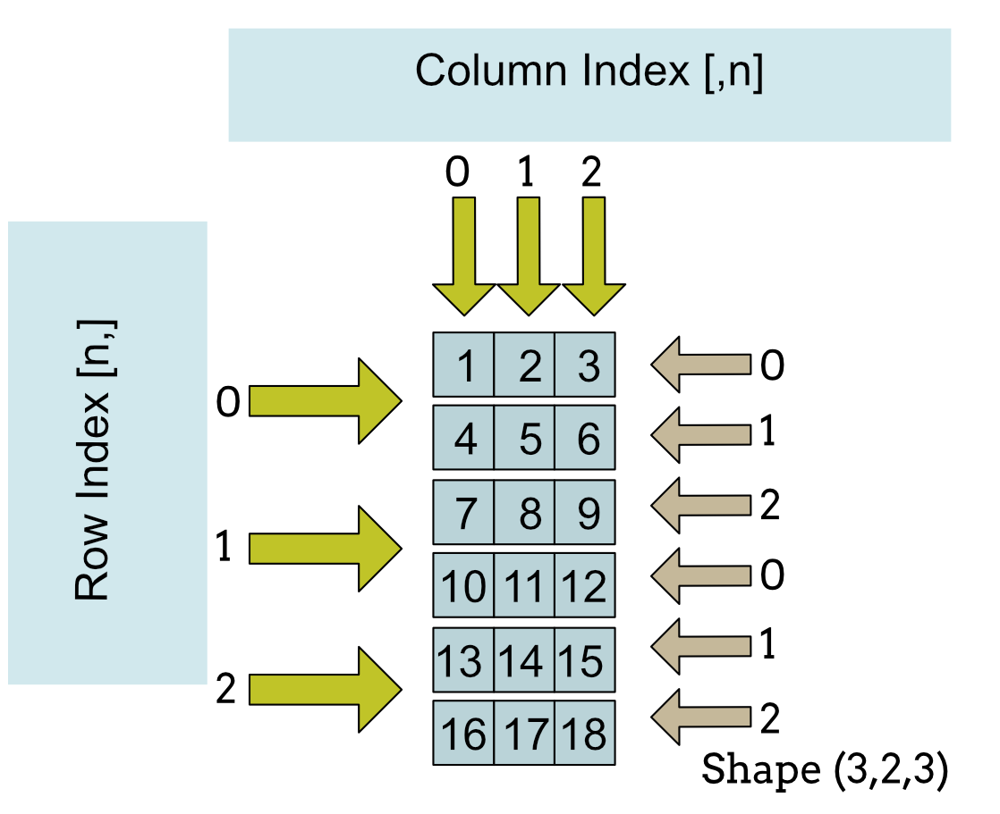

# Embedded AI systems Part 2

## Abstract

Embedded artificial intelligence (AI) stands at the forefront of technological innovation, presenting novel opportunities for cost-effective and energy-efficient AI solutions that extend beyond the capabilities of cloud-based AI technologies. This article is the second in a series that explores the rapidly growing field of embedded AI.

Devices targeting Edge AI are set to experience exponential growth within the chip market. By 2024, an estimated 1.5 billion edge AI chips are anticipated to be sold, indicating a substantial surge in demand and deployment.

## Introduction

One of the challenges of handling data from embedded devices is knowing how to preprocess it into a form that AI models can use. The Python libraries Pandas and NumPy offer many features that allow us to preprocess data in an efficient and compact way.

## Pandas

Pandas is an open-source Python library that provides high-level data structures and data analysis tools. It is widely used for data manipulation, analysis, and visualization tasks in data science and machine learning projects.

### Data Representation

**DataFrame:** A DataFrame is a two-dimensional labeled data structure with columns of potentially different types. It is part of the pandas library and is designed for handling tabular data. A DataFrame is specifically designed to be a two-dimensional labeled data structure. It cannot have more than two dimensions. Each column in a DataFrame represents a different variable, and each row represents a different observation.


### Data Types

DataFrames can contain columns of different data types (e.g., integers, floats, strings, etc.). Each column in a DataFrame is essentially a pandas Series, which can have its own data type.

### Indexing and Labeling

DataFrames support both integer-based and label-based indexing. Columns and rows can have user-defined labels, making it easy to reference specific subsets of data using these labels. The row and column labels in a DataFrame can be accessed through the `index` and `columns` attributes, respectively. In pandas DataFrames, when using `.loc[]`, you first specify the row label and then the column label.

### Functionality

DataFrames offer a wide range of functionality for data manipulation and analysis, including data alignment, grouping, merging, reshaping, and more. They also support missing data handling and time series functionality.

- [Pandas DataFrame Cheatsheet](https://www.webpages.uidaho.edu/~stevel/cheatsheets/Pandas%20DataFrame%20Notes_12pages.pdf)

### Libraries

DataFrames are part of the pandas library, which is built on top of NumPy. pandas provides high-level data structures and functions designed for data analysis and manipulation.

### Examples

#### Creating a Dataframe.

```python
# Creating a DataFrame from a dictionary
data = {
    'Name': ['John', 'Anna', 'Peter', 'Linda'],
    'Age': [28, 35, 23, 45],
    'City': ['Rome', 'Paris', 'London', 'Sydney']
}

df = pd.DataFrame(data)

print(df)
```

```
    Name  Age    City
0   John   28    Rome
1   Anna   35   Paris
2  Peter   23  London
3  Linda   45  Sydney
```


#### Referencing Elements in the Dataset

**Note**: In pandas DataFrames, when using .loc[], you first specify the row label and then the column label.

```python
print(f"Element at '0', 'Name': {df.loc[0, 'Name']}")
print(f"Element at '0', 'Name': {df.loc[0, 'City']}")
print(f"Element at position (0, 1): {df.iloc[0, 1]}")
print(f"Element at position (2, 2): {df.iloc[2, 2]}")
```

```
Element at '0', 'Name': John
Element at '0', 'Name': Rome
Element at position (0, 1): 28
Element at position (2, 2): London
```

## NumPy

NumPy is a fundamental Python library for numerical computing that provides support for large, multi-dimensional arrays and matrices, along with a collection of mathematical functions to operate on these arrays efficiently. It is an essential tool in the Python data science ecosystem and is widely used in various fields such as scientific computing, machine learning, and engineering.

### Data Representation

A NumPy array is a grid of values of the same type. It is part of the NumPy library and is used for numerical computing. While arrays can have multiple dimensions, they lack built-in support for row and column labels.


### Data Types

NumPy arrays are homogeneous, meaning all elements in an array must have the same data type. This allows for more efficient storage and operations on numerical data.

### Indexing and Labeling

NumPy arrays support only integer-based indexing. While you can create separate arrays to store row and column labels, NumPy arrays themselves do not have built-in support for labels.

### Functionality

NumPy arrays provide fundamental array operations and mathematical functions for numerical computing. They are optimized for numerical operations and are widely used in scientific computing and machine learning.

- [NumPy Cheat Sheet](https://assets.datacamp.com/blog_assets/Numpy_Python_Cheat_Sheet.pdf)

### Libraries

NumPy arrays are part of the NumPy library, which is a fundamental package for numerical computing in Python. NumPy provides support for multidimensional arrays, mathematical functions, random number generation, and more.

## TensorFlow

TensorFlow is a popular library for working with tensors in Python. Developed by Google, TensorFlow is an open-source machine learning framework that provides comprehensive support for building and training deep learning models. Tensors are the primary data structures used in TensorFlow to represent multi-dimensional arrays of data.

### Data Representation

In TensorFlow, data is represented primarily using tensors, which are multi-dimensional arrays with a fixed data type. Tensors can have any number of dimensions, allowing for flexible representation of data ranging from scalars (0-dimensional tensors) to higher-dimensional arrays. TensorFlow tensors can hold numerical data, such as integers or floating-point numbers, as well as string data and boolean values.




### Data Types

TensorFlow tensors have a fixed data type, which determines the kind of data they can hold. Some of the more common data types supported by TensorFlow include `tf.float32`, `tf.int32`, `tf.bool`, and `tf.string`.

### Indexing and Labeling

TensorFlow tensors support indexing and slicing operations to access elements or sub-tensors within a tensor. Indexing in TensorFlow tensors follows the same conventions as indexing in Python lists or NumPy arrays, allowing for both single-element access and slicing along multiple dimensions. Additionally, TensorFlow tensors can be labeled or named using descriptive variable names, making it easier to understand and manage complex computation graphs.

### Functionality

TensorFlow tensors support a wide range of mathematical operations and functions for performing computations. Operations can be performed element-wise (e.g., addition, multiplication) or across multiple dimensions (e.g., matrix multiplication, reduction operations). TensorFlow provides a rich library of built-in functions for common operations, as well as mechanisms for defining custom operations using TensorFlow's computational graph.

### Libraries

TensorFlow provides several high-level APIs and libraries for building and training machine learning models.

- [TensorFlow Cheat Sheet](https://www.beoptimized.be/pdf/TensorFlow2Cheatsheet.pdf)

## Identifying Data Types

The function below can identify various types of data structures we are likely to encounter when preparing data. The ability to understand a data structure is essential when resolving issues with the format or shape of the data.

```python
def analyze_object(obj):
    print("------------------------Object Analysis Begins--------------------------")
    # Check if it's a Series
    if isinstance(obj, pd.Series):
        print("Object is a pandas Series")
        print("Shape:", obj.shape)
        print("Length of Series:", obj.shape[0])
        print("Type of elements:", type(obj.iloc[0]))
        print("First 3 elements:")
        print(obj.head(3))
    # Check if it's a DataFrame
    elif isinstance(obj, pd.DataFrame):
        print("Object is a pandas DataFrame")
        print("Shape:", obj.shape)
        print("Length of Series:", len(obj))
        print("Types of elements:")
        print(obj.dtypes)
        for column in obj.columns:
            print(f"Type of elements in column '{column}':", type(obj[column].iloc[0]))
        # Check type of elements in each row
        for index, row in obj.iterrows():
            print(f"Type of elements in row '{index}':", type(row.iloc[0]))
        print("First 3 elements:")
        print(obj.head(3))
    # Check if it's a NumPy array
    elif isinstance(obj, np.ndarray):
        print("Object is a NumPy array")
        print("Shape:", obj.shape)
        print("Number of dimensions in this array: ", obj.ndim)
        print("Length of NumPy Array:", len(obj))
        print("Type of elements:", obj.dtype)
        print("First 3 elements:")
        print(obj[:3])
    # Check if it's a TensorFlow tensor
    elif tf.is_tensor(obj):
        print("Object is a TensorFlow tensor")
        print("Shape:", obj.shape)
        print("Length of TensorFlow Object:", obj.shape[0])
        print("Data type:", obj.dtype)
        print("First 3 elements:")
        print(obj[:3])
    else:
        print("Unknown type")
```
