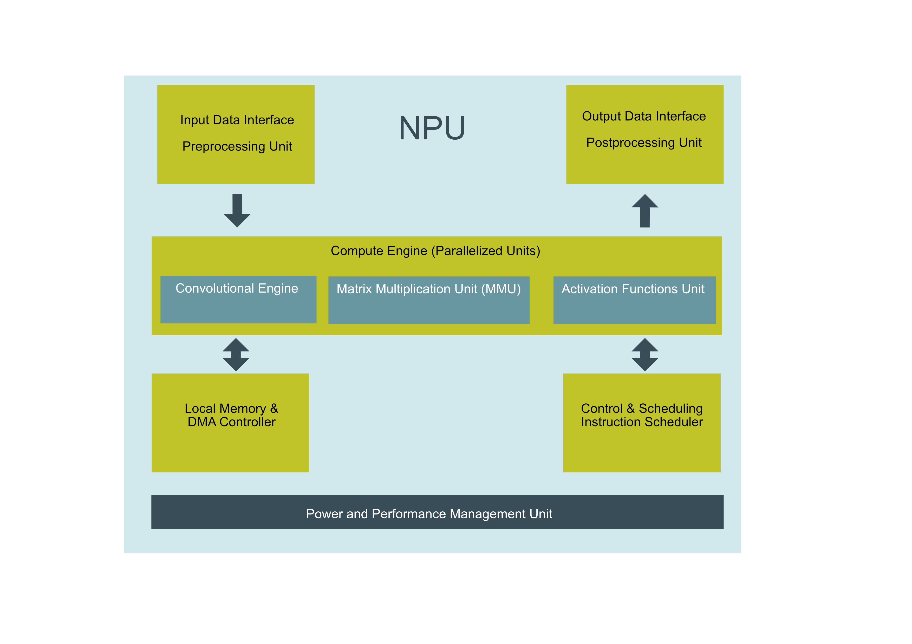

# Using an NPU to Accelerate Inference

## Introduction

The emergence of Neural Processing Units (NPUs) represents a significant evolution in computing, driven by the growing demand for efficient AI processing across a wide range of devices. Once exclusive to specialized hardware for data centers, NPUs are now becoming mainstream, with manufacturers like Intel integrating them into consumer-grade processors such as the Intel Core Ultra series. This trend reflects the shift toward AI-driven workloads in everyday applications, from voice recognition and real-time language translation to advanced image and video processing. At the edge, NPUs are increasingly found in IoT devices, smartphones, and embedded systems, enabling local AI inference with low latency and energy efficiency. As the adoption of AI accelerates, NPUs are poised to become a standard feature in computing hardware, bridging the gap between the demands of modern AI applications and the constraints of traditional CPU and GPU architectures. This democratization of AI capabilities promises to unlock a new era of innovation across industries, from smart homes to autonomous systems.
A Neural Processing Unit (NPU) is a specialized hardware accelerator designed to optimize the performance of machine learning (ML) tasks, especially for inference. Inference is the process of using a trained model to make predictions or decisions based on new data. NPUs are tailored to the unique requirements of these tasks, providing significant improvements in speed and efficiency compared to traditional processors like CPUs or even GPUs.

Neural Processing Units (NPUs) are becoming an integral component of modern processors, designed to handle AI workloads more efficiently than traditional CPUs. The RV1106, a processor built for edge applications, features an integrated NPU that offers a practical example of how these specialized units can be utilized for tasks like inference. This article examines the architecture and performance of the RV1106's NPU, comparing its capabilities to CPU-based processing for AI inference tasks. By exploring these, we aim to provide a clear understanding of the performance improvements that NPUs bring to edge computing, helping you grasp their growing significance in AI-driven devices.

## NPU Architecture and Design



_Figure 1: NPU Block Diagram_

A Neural Processing Unit (NPU) is a specialized architecture designed to accelerate AI tasks, primarily deep learning inference. Its core functionality is divided into several key components (shown in _Figure 1_ above), each playing a critical role in optimizing performance and efficiency.

The input processing block is the entry point of the NPU, responsible for receiving data from the CPU or memory. This block ensures that data is preprocessed and formatted in a way that aligns with the requirements of the neural network model. This specifc NPU is optimised for image processing, so it expects the data in a format (for example: NHWC format) that aligns with the models expectations. By offloading this step from the CPU, the input processing block reduces latency and prepares the data for efficient computation.

The compute engine is the heart of the NPU, where the majority of operations, such as matrix multiplications and convolutions, take place. This block is designed to handle the high computational demands of neural networks, leveraging parallelism and specialized arithmetic units to perform these tasks rapidly. It supports both integer and floating-point calculations, enabling flexibility in running various models with different precision requirements.

The activation and pooling block is dedicated to non-linear transformations and dimensionality reductions. Neural networks rely on activation functions, such as ReLU, to introduce non-linearities, which are crucial for learning complex patterns. Pooling operations, on the other hand, reduce the spatial size of feature maps, which helps in lowering computational load and improving generalization. This block executes these functions efficiently in hardware.

The memory management unit coordinates data movement between the NPU and memory. Neural networks often process large datasets and generate substantial intermediate results, requiring careful optimization of memory access patterns. This unit minimizes bottlenecks by ensuring that data is fetched, stored, and reused efficiently, reducing delays caused by memory latency.

The control logic orchestrates the overall functioning of the NPU, managing task scheduling and execution order. It ensures that operations across the various blocks are synchronized and executed in the correct sequence. By automating these processes, the control logic allows the NPU to operate independently, minimizing the need for CPU intervention.

The output processing block prepares the results for the next stage, whether it’s further computation, visualization, or storage. It formats the output data appropriately and transfers it back to the CPU or memory, completing the inference process. This block helps maintain the integrity and usability of the results, streamlining the overall workflow.

A critical feature of the NPU is its power management capability. The NPU is designed to deliver substantial computational power at far lower energy levels compared to traditional GPUs, which would require significantly more power to achieve similar performance. This efficiency stems from the NPU's highly specialized architecture, which is tuned exclusively for AI inference. This makes NPUs an attractive solution for edge and embedded devices, where power availability is limited, and energy efficiency is paramount.
NPUs achieve significantly higher performance and efficiency, enabling real-time applications in fields like autonomous driving, healthcare, and natural language processing.

# Object Detection on LuckFox

In my previous [article](https://medium.com/@johnos3747/an-introduction-to-object-detection-8374539b1f11) we explored YOLO (You Only Look Once) in detail. Today, we'll compare two implementations of YOLO on the Luckfox Pico Pro: one that relies solely on the Cortex-A7 CPU and another that takes advantage of its integrated Neural Processing Unit (NPU). The Luckfox Pico Pro is a compact Linux microdevelopment board powered by the Rockchip RV1106 system-on-chip (SoC). This SoC integrates a Neural Processing Unit (NPU) designed to accelerate machine learning inference tasks. The RV1106 is based on single-core ARM Cortex-A7 32-bit core which integrates NEON and FPU. Its NPU supports INT4/INT8/INT16 hybrid operation and its computing power is up to 0.5TOPs.

Both the CPU and NPU implementation will use the same input image, but there is a slight difference in the image size due to model compatibility. The NPU implementation processes images at a preferred size of 640x640, while the CPU implementation uses 416x416, as required by the YOLO Tiny model we are using.

The software for both versions can be found in my [github repository](https://github.com/johnosbb/Artificial-intelligence/tree/main/ObjectDetection/Yolo). For the CPU implementation I will be using my [Darknet Embedded library](https://github.com/johnosbb/darknet_embedded).

In this section, we look further into a detailed comparison of object detection performance between a software-only implementation running on the Luckfox Pico Pro's Cortex-A7 CPU and an optimized implementation utilizing its NPU. This analysis is based on the timing statistics of key stages in the inference process, including network loading, image loading, class name loading, prediction, and post-processing. Both approaches employ the YOLO models, with the software implementation using a 416x416 input size and the NPU using a slightly larger 640x640 input size. The results highlight the performance benefits provided by the NPU, especially in terms of speed and efficiency.

## CPU only Performance

```
Using input size: 416x416 as per yolov3-tiny.cfg
loading cfg: yolov3-tiny.cfg, weights: yolov3-tiny.weights, clear = 0
Total BFLOPS 5.571

Network loaded with 24 layers.
Original image dimensions: 640x424
Detected object: Class sheep, Probability 0.83, Box with normalised locations [Center: (0.78, 0.55) Width: 0.35 Height: 0.51]
Box in original image size pixel locations: Box [Center: (501.82, 347.49) Width: 226.71 Height: 215.69]
Detected object: Class dog, Probability 0.81, Box with normalised locations [Center: (0.22, 0.72) Width: 0.10 Height: 0.14]
Box in original image size pixel locations: Box [Center: (140.49, 420.26) Width: 62.31 Height: 61.36]
Detected object: Class dog, Probability 0.89, Box with normalised locations [Center: (0.22, 0.73) Width: 0.19 Height: 0.20]
Box in original image size pixel locations: Box [Center: (141.57, 422.24) Width: 121.81 Height: 86.42]
Detected object: Class person, Probability 0.98, Box with normalised locations [Center: (0.36, 0.56) Width: 0.15 Height: 0.68]
Box in original image size pixel locations: Box [Center: (229.56, 352.94) Width: 98.66 Height: 286.97]
```

**Timing statistics:**

- Network loading time (ms): 4712.62
- Image loading time (ms): 597.75
- Class names loading time: (ms) 1.27
- Prediction time (ms): 196712.35
- Post_processing time (ms): 9.66 seconds
- Total time: (ms) 202033.65

## NPU Performance

```
Model Path: yolov5s-640-640.rknn
rknn_api/rknnrt version: 1.4.1b9 (09eb4be80@2022-10-19T09:51:39), driver version: 0.8.2
result 0: ( 187, 161, 273, 563), person
result 1: ( 402, 213, 601, 520), horse
result 4: ( 66, 400, 203, 524), dog
```

### Confidence Levels

```
person @ (187 161 273 563) Probability 0.895416
horse @ (402 213 601 520) Probability 0.872058
dog @ (66 400 203 524) Probability0.864517

```

**Timing statistics:**

- Network loading time (ms): 4.93
- Image loading time (ms): 262.38
- Class names loading time: (ms) 0.44
- Prediction time (ms): 83.08
- Post Processing (ms): 11.37
- Total time: (ms) 361.76


## Comparing performance

| Timing Statistics        | NPU (ms)   | Software Only (ms) |
| ------------------------ | ---------- | ------------------ |
| Network loading time     | 4.93       | 4712.62            |
| Image loading time       | 262.38     | 597.75             |
| Class names loading time | 0.44       | 1.27               |
| Prediction time          | 83.08      | 196712.35          |
| Post processing time     | 11.37      | 9.66               |
| **Total time**           | **361.76** | **202033.65**      |

| Timing Statistics | NPU (seconds) | Software Only (seconds) |
| ----------------- | ------------- | ----------------------- |
| **Total time**    | **0.36176**   | **202.03365**           |

The performance difference between the CPU and NPU implementations is impressive. For network loading, the NPU completes the task 956 times faster than the CPU, reducing the time from over 4.7 seconds to just 4.93 milliseconds. The prediction stage shows an even more significant improvement, with the NPU achieving inference 2368 times faster than the CPU, completing the task in just 83.08 milliseconds compared to the CPU's 196.7 seconds. Overall, the NPU implementation processes the entire inference pipeline in 0.36 seconds, whereas the CPU implementation takes 202.03 seconds.

This significant improvement demonstrates the specialized efficiency of NPUs for inference tasks. Beyond just raw speed, the NPU achieves this performance with lower power consumption compared to a CPU or GPU, making it an ideal solution for edge devices where power efficiency is critical. These results highlight the NPU's role in enabling real-time AI applications that were previously impractical on embedded systems.
