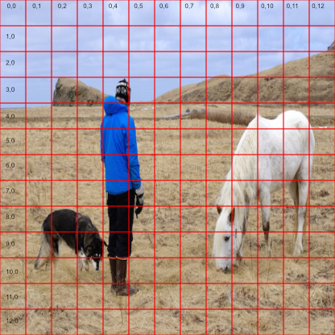
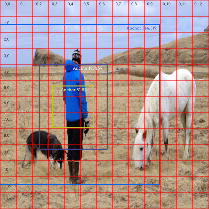
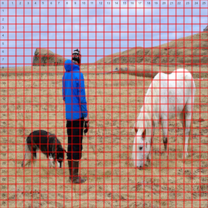
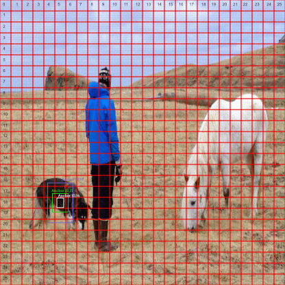
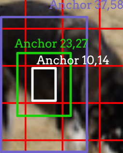
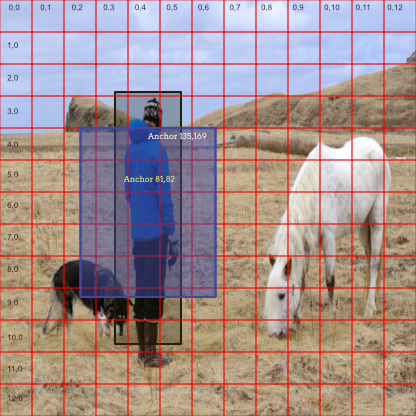
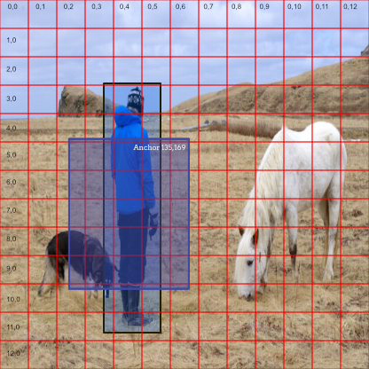
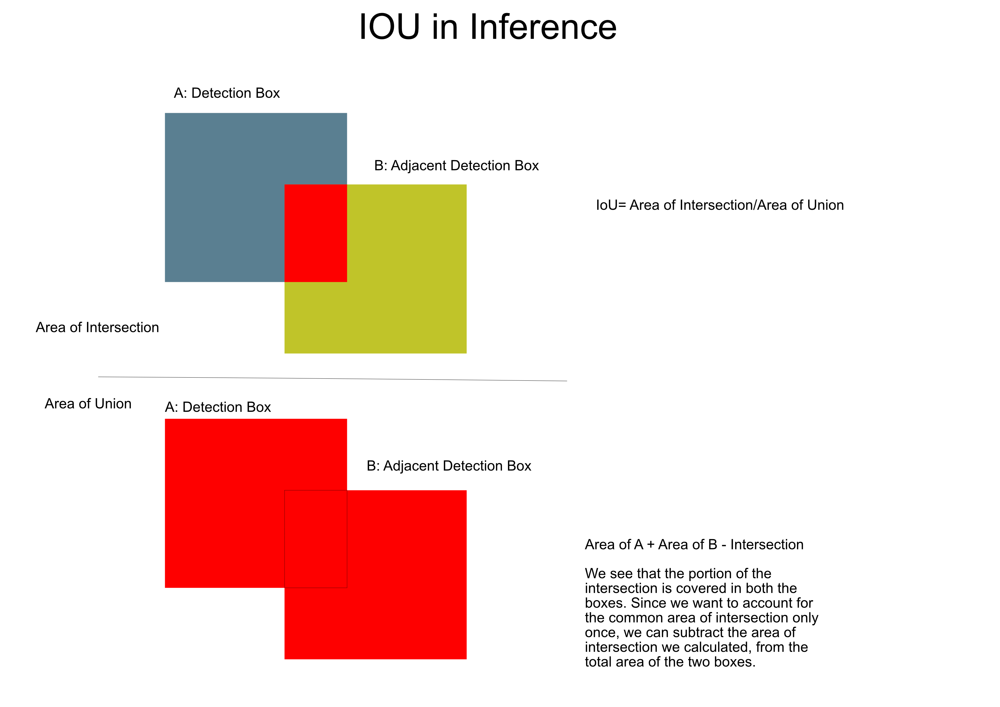
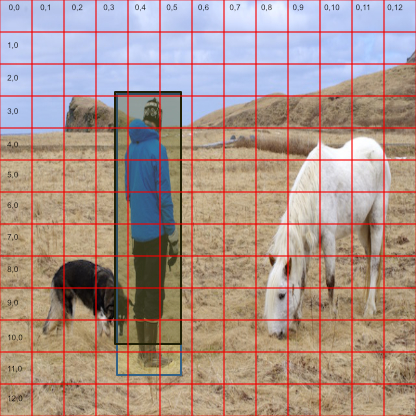
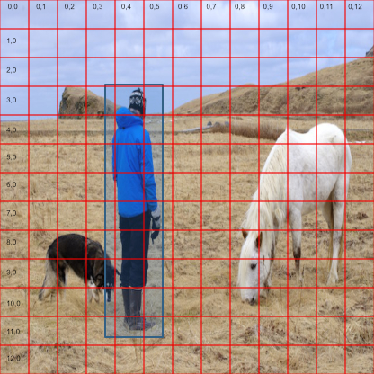

## Yolo 3

### Introduction to Tiny YOLO v3

Object detection is a critical task in computer vision, enabling systems to identify and locate objects within an image or video. Among the popular object detection algorithms, YOLO (You Only Look Once) stands out for its real-time performance and accuracy. However, the standard YOLO models can be computationally intensive, making them less suitable for devices with limited resources. This is where Tiny YOLO v3 comes into play.

Tiny YOLO v3 is a lightweight version of the YOLO v3 model, optimized for devices with limited computational power, such as mobile phones, edge devices, and embedded systems. While it sacrifices some accuracy compared to the full YOLO v3, it significantly reduces computational requirements and inference time, making it ideal for real-time object detection in resource-constrained environments.

In essence, YOLO divides the input image into a grid and predicts bounding boxes, objectness scores, and class probabilities for each grid cell. This allows the model to directly predict the location and class of objects within the image in a single forward pass, making it significantly faster than traditional object detection methods.



_Figure 1: Image with 13x13 grid_

Key Features of Tiny YOLO v3:

- Lightweight Architecture: Fewer layers and parameters compared to YOLO v3.
- Faster Inference Time: Optimized for real-time applications.
- Lower Accuracy: A trade-off for speed and efficiency.
- Compatibility: Can run on embedded systems like Raspberry Pi.

### Configuration of the Model

YOLOv3 models, including Tiny YOLOv3, are configured through a .cfg (configuration) file. This file serves as a blueprint for the model architecture and defines key parameters, including the number and types of layers, filter sizes, activation functions, and anchor box dimensions. Each layer is specified with its unique settings, such as the number of filters, kernel size, stride, and padding. Additionally, the configuration file contains hyperparameters for training, such as learning rate, momentum, and batch size. The flexibility of the .cfg file allows developers and researchers to modify the architecture and experiment with different configurations without altering the core codebase.

### The Yolo Network

Throughout this article we will refer to the _network_ or the _YOLOv3 network_. This is a blanket term that generally encompasses:

- The Darknet-53 backbone for feature extraction.
- The FPN-style neck for multi-scale feature representation. FPN stands for _Feature Pyramid Network_ as Yolo uses this architecture to make predictions at three different scales, providing better performance on small, medium, and large objects.
- The detection head layers for final predictions (bounding boxes, objectness, class probabilities).

All these components work together as an end-to-end object detection pipeline that processes an input image in a single forward pass, achieving real-time detection performance.

### Layers used in the Yolo Model

For our evaluation we will use the following 24 layer model.

| Layer | Type     | Filters | Size/Strides | Input Dimension | Output Dimension | BFLOPS   |
| ----- | -------- | ------- | ------------ | --------------- | ---------------- | -------- |
| 0     | conv     | 16      | 3x3/1        | 416x416x3       | 416x416x16       | 0.150 BF |
| 1     | max      |         | 2x2/2        | 416x416x16      | 208x208x16       | 0.003 BF |
| 2     | conv     | 32      | 3x3/1        | 208x208x16      | 208x208x32       | 0.399 BF |
| 3     | max      |         | 2x2/2        | 208x208x32      | 104x104x32       | 0.001 BF |
| 4     | conv     | 64      | 3x3/1        | 104x104x32      | 104x104x64       | 0.399 BF |
| 5     | max      |         | 2x2/2        | 104x104x64      | 52x52x64         | 0.001 BF |
| 6     | conv     | 128     | 3x3/1        | 52x52x64        | 52x52x128        | 0.399 BF |
| 7     | max      |         | 2x2/2        | 52x52x128       | 26x26x128        | 0.000 BF |
| 8     | conv     | 256     | 3x3/1        | 26x26x128       | 26x26x256        | 0.399 BF |
| 9     | max      |         | 2x2/2        | 26x26x256       | 13x13x256        | 0.000 BF |
| 10    | conv     | 512     | 3x3/1        | 13x13x256       | 13x13x512        | 0.399 BF |
| 11    | max      |         | 2x2/1        | 13x13x512       | 13x13x512        | 0.000 BF |
| 12    | conv     | 1024    | 3x3/1        | 13x13x512       | 13x13x1024       | 1.595 BF |
| 13    | conv     | 256     | 1x1/1        | 13x13x1024      | 13x13x256        | 0.089 BF |
| 14    | conv     | 512     | 3x3/1        | 13x13x256       | 13x13x512        | 0.399 BF |
| 15    | conv     | 255     | 1x1/1        | 13x13x512       | 13x13x255        | 0.044 BF |
| 16    | yolo     |         | -            | 13x13x255       | -                | -        |
| 17    | route    |         | -            | 13              | 13x13x256        | -        |
| 18    | conv     | 128     | 1x1/1        | 13x13x256       | 13x13x128        | 0.011 BF |
| 19    | upsample |         | -            | 13x13x128       | 26x26x128        | -        |
| 20    | route    |         | 19 8         | -               | 26x26x384        | -        |
| 21    | conv     | 256     | 3x3/1        | 26x26x384       | 26x26x256        | 1.196 BF |
| 22    | conv     | 255     | 1x1/1        | 26x26x256       | 26x26x255        | 0.088 BF |
| 23    | yolo     |         | -            | 26x26x255       | -                | -        |

### Layer Breakdown for our Yolo Model

Let us take a look at these different layer types in the context of object detection.

- Convolutional Layers (conv)

  - Layers: 0, 2, 4, 6, 8, 10, 12, 13, 14, 21
  - Purpose: Feature extraction by applying convolutional filters. These layers are crucial for detecting patterns like edges, textures, and more complex features at deeper layers.
  - Total: 10 layers (conv layers).

- Max Pooling Layers (max)

  - Layers: 1, 3, 5, 7, 9, 11
  - Purpose: Downsample the feature map by taking the maximum value in each local region. This reduces the spatial dimensions (height and width) while retaining the most important information.
  - Total: 6 layers (max pooling).

- YOLO Layers (yolo)

  - Layers: 16, 23
  - Purpose: Perform object detection by predicting class labels, bounding box coordinates, and confidence scores. The output consists of class probabilities and bounding boxes for each grid cell.
  - Total: 2 layers (YOLO layers).

- Route Layer (route)

  - Layers: 17, 20
  - Purpose: This layer concatenates feature maps from different parts of the network to provide multi-scale feature information for later stages, such as detection.
  - Total: 2 layers (route layers).

- Upsample Layers (upsample)
  - Layer: 19
  - Purpose: Upsample the feature map, increasing its spatial resolution, which is especially useful for models like YOLO that need high-resolution feature maps for detection.
  - Total: 1 layer (upsample layer).

### First Layer

```
 0 conv     16       3 x 3/ 1    416 x 416 x   3 ->  416 x 416 x  16 0.150 BF
```

After the first layer we are left with an output of 416 x 416 x 16. The input representing the image 416 x 416 x 3 (the 3 is the colour components R,G and B) goes through a convolutional layer with 16 filters. Each filter extracts a specific feature map from the image (e.g., edges, textures, patterns) producing of 16 feature maps. Each of these 16 channels represents a different feature map that was detected by one of the 16 convolutional filters. A convolutional filter (e.g., 3×3×3 for RGB input) slides over the image and computes a dot product at each position, producing a single channel output per filter, so with 16 filters, you get 16 channels in the output. We can also see in this output that this process took 0.150 BF, which means this convolutional layer requires 0.150 billion floating-point operations to process the input.

A kernel (or filter) is a small matrix used to extract specific features from an image, such as edges or textures. In our case we can calculate the billion floating-point operations using the following formula:

$FLOPs = 2 \cdot (k^2) \cdot C_{in} \cdot C_{out} \cdot W \cdot H$

where k is kernel size (3 x 3) and C is the number of channels, and W, H is the width and height. This fives us:

$= 2 \cdot 9 \cdot 3 \cdot 16 \cdot 416 \cdot 416$
$= 149,520,384$

and as:

$1 \text{ BFLOP} = 10^9 \text{ FLOPs}$

We have a final calculation of:

$BFLOPS = \frac{149,520,384}{1,000,000,000} = 0.150 \text{ BFLOPS}$.

### Second Layer

```
   1 max                2x 2/ 2    416 x 416 x  16 ->  208 x 208 x  16 0.003 BF
```

The second layer is responsible for downsizing the image feature maps, so the width and height of the feature map are reduced by a factor of 2 (e.g., from $416 \times 416$ to $208 \times 208$). This reduces the computational cost and memory usage in subsequent layers. Smaller feature maps mean fewer calculations and less data to process. Each pixel in the downsampled feature map corresponds to a larger region in the original image and this allows the network to "see" larger parts of the image at higher levels, which helps in understanding more abstract and global features. Lower-level layers capture fine details, while downsampled layers focus on more abstract, high-level features. Object detection benefits from both local fine-grained details (e.g., edges, textures) and higher-level features (e.g., shapes, patterns).

As we indicated earlier YOLO predicts objects at multiple scales (FPN-style architecture). Downsampling creates multi-scale feature maps that enable the network to detect both small and large objects effectively. Smaller objects might be detected in earlier layers (finer resolution), while larger objects are detected in later layers (coarser resolution). Reducing the dimensions reduces the number of parameters in subsequent layers and this process also helps prevent overfitting, especially when training with limited data.

### Third Layer

```
   2 conv     32       3 x 3/ 1    208 x 208 x  16 ->  208 x 208 x  32 0.399 BF
```

The third layer performs convolution with 32 filters of size $3 \times 3$. Each filter is applied to the input feature map (of size 208 x 208 x 16), creating 32 different feature maps. This layer extracts different features from the previous layer’s outputs, such as edges, textures, or patterns. While the spatial dimensions (height and width) of the feature map remain the same (208 x 208), the depth increases from 16 to 32, indicating that the network is learning to represent more complex features by adding additional channels. After passing through earlier layers, the network is beginning to capture higher-level features, such as combinations of basic edges and textures. The third convolution layer allows for more sophisticated abstraction by increasing the number of features extracted from the image.

### Intermediate Layers

This process of convulution and Pooling continues for a number of layers.

### Layer 16

YOLO uses a technique called anchor boxes (or prior boxes) to help guide the model in predicting bounding box shapes. Anchor boxes are predefined bounding boxes with fixed aspect ratios and sizes, which represent typical object shapes.

In Yolo these anchors are defined in the cfg file

```
[yolo]
mask = 3,4,5
anchors = 10,14,  23,27,  37,58,  81,82,  135,169,  344,319
classes=80
num=6
jitter=.3
ignore_thresh = .7
truth_thresh = 1
random=1
```

The mask specifies which anchors are used at a particular YOLO layer.
In this example the mask is 3,4,5 so only anchors 3, 4, and 5 (81,82, 135,169, 344,319) will be used at this detection layer.
Different YOLO layers often focus on detecting objects at different scales.

In Layer 16 (with a 13×13 grid), the model assigns three anchor boxes to each grid cell. At this lower resolution, these anchor boxes are primarily responsible for detecting larger objects in the image.



_Figure 2: Anchor boxes for grid cell 6,4 on the 13 x 13 grid_

The YOLO network will refine these anchor boxes and then calculate:

- An objectness score, which estimates the likelihood that the box contains any object.
- Class probabilities, which estimate the likelihood that the detected object belongs to one of the predefined classes specified in the coco.names file.

Together, these scores help YOLO determine what the object is and where it is located in the image.

### Layer 23

In layer 23 a 26×26 grid is used. This grid size is used to smaller objects, as well as the class probabilities and objectness scores for each of those boxes.



_Figure 3: Image with the 26 x 26 grid overlayed_

The process is similar to layer 16, the model assigns three anchor boxes to each grid cell and then again calculates an objectness score and class probabilities for each of the anchor boxes. Again, the cfg file defines the anchor box dimensions and the mask indicates for this layer we should use: `10,14,  23,27,  37,58`

```
[yolo]
mask = 0,1,2
anchors = 10,14,  23,27,  37,58,  81,82,  135,169,  344,319
classes=80
num=6
jitter=.3
ignore_thresh = .7
truth_thresh = 1
random=1
```



_Figure 4: 26 x 26 grid with Anchor Boxes on Cell 18,5_



_Figure 5: Detailed View of 26 x 26 grid with Anchor Boxes on Cell 18,5_

### Example: How YOLO Uses Bounding Boxes and Objectness Scores

- Suppose we have an image of size **416×416** and a **13×13 grid** (optimized for detecting **large objects**).
- The YOLO model divides the image into **13×13 grid cells**.
- Each **grid cell** predicts **3 bounding boxes**, where each bounding box includes:
  - **Coordinates**: _(x, y, w, h)_ representing the center (x, y), width (w), and height (h) of the box.
  - An **objectness score**: Represents the **confidence** that the box contains any object.
  - **Class probabilities**: A probability distribution across all object classes (e.g., _dog_, _car_, etc.).

For a **single grid cell**, YOLO might predict:

- **Box 1:**

  - **Coordinates:** _(x=0.2, y=0.3, w=0.4, h=0.5)_
  - **Objectness Score:** **0.8** _(80% confident that an object is present)_
  - **Class Probabilities:** _(dog=0.9, car=0.1, ...)_ — likely a **dog**.

- **Box 2:**

  - **Coordinates:** _(x=0.6, y=0.4, w=0.3, h=0.2)_
  - **Objectness Score:** **0.4** _(40% confident that an object is present)_
  - **Class Probabilities:** _(dog=0.3, car=0.7, ...)_ — likely a **car**.

- **Box 3:**

  - **Coordinates:** _(x=0.8, y=0.7, w=0.2, h=0.2)_
  - **Objectness Score:** **0.9** _(90% confident that an object is present)_
  - **Class Probabilities:** _(dog=0.9, car=0.1, ...)_ — likely a **dog**.

The network starts with a set of anchor boxes of a predefined size: (w anchor ,h anchor ). These anchors act as reference shapes for potential objects in the image. For each of these boxes the _network_ predicts offsets: (ŵ, ĥ). These offsets (which can be psoitive or negative) are used to further refine the anchor boxes dimensions to more closely match the actual object dimensions. The predicted x and y values are normalized offsets (ranging between 0 and 1) relative to the top-left corner of the grid cell. The predicted offsets are passed through an exponential function (e^(ŵ), e^(ĥ)) to ensure the final width and height remain positive.

#### Transforming Bounding Box Coordinates and Dimensions

The final center coordinates $(x_{\text{final}}, y_{\text{final}})$ of the predicted bounding box are calculated using the grid cell location, normalized offsets $(x)$ and $(y)$, and the size of each grid cell.

**Formulas:**

- $x_{\text{final}} = (grid\_x + x) \times cell\_width$
- $y_{\text{final}} = (grid\_y + y) \times cell\_height$

**Where:**

- $grid\_x$: The x-coordinate of the grid cell.
- $grid\_y$: The y-coordinate of the grid cell.
- $x$: Normalized horizontal offset (e.g., 0.62).
- $y$: Normalized vertical offset (e.g., 0.49).
- $cell\_width$: The width of a grid cell.
- $cell\_height$: The height of a grid cell.

We can calculate the final width and height as follows:

- $w_{\text{final}} = w_{\text{anchor}} \times e^{\hat{w}}$
- $h_{\text{final}} = h_{\text{anchor}} \times e^{\hat{h}}$

If the centre of a bounding box falls within a cell then that cell is responsible for that bounding box. These refined bounding boxes (with accurate width and height after transformation) are then scored for objectness (how confident the model is about an object being present) and for class probabilities (which class the object belongs to).

If we take anchor box 1 which was centred on grid cell 6,4 (see figure 6 below) we can see this refinement in action. The box shown in blue is the original anchor box and the box shown with a black outline is the refined bounding box which has been transformed in the process described above. One can see how the box more closely maps to the human figure first identified in grid cell 6,4.



_Figure 6: Anchor Box 1 and the Refined Bounding Box for that Anchor centered on Cell 6,4_

### Objectness

The objectness score is a scalar value (ranging from 0 to 1) predicted for each anchor box. It represents the model's confidence that an object exists within that specific anchor box. If the objectness score exceeds a predefined threshold (e.g., 0.5), the model considers the anchor box to contain an object.

Objectness Score ($P_{\text{obj}}$)

#### Objectness Threshold

The threshold is a predefined value used to determine whether an anchor box contains an object or not, based on the objectness score ($P_{\text{obj}}$).

In most YOLO implementations the default objectness threshold is set to $0.5$. This means if $P_{\text{obj}} > 0.5$, the model considers the anchor box to contain an object.

The threshold can be adjusted based on the application:

- Higher Threshold (e.g., 0.7): Reduces false positives but might miss some valid detections (false negatives).
- Lower Threshold (e.g., 0.3): Increases the number of detected objects but might introduce more false positives.

The refined bounding box shown in figure 6 above had an associated objectness score of 0.348, so there is a low level of confidence on that particular box.

However, if we look at anchor box 1 centered on grid cell 7,4 we get a much higher objectness score of 0.979016 for the refined bounding box (see figure 7 below).



_Figure 7: Anchor Box 1 and the Refined Bounding Box for that Anchor centered on Cell 7,4_

#### Selecting and sorting based on Objectness

The objectness score is a probability between 0 and 1 that indicates the confidence level of the model that an object exists in a specific anchor box. If the objectness score exceeds the threshold, the anchor box is considered to contain an object. If it falls below the threshold, the box is ignored during the next stages of processing.

### Class Probability

For each anchor box where the objectness score is high enough, YOLO also predicts a class probability distribution over all possible object classes. The class with the highest probability is used to determine the predicted class.

Class Probabilities ($P_{\text{class}_i}$)

For the refined bounding box shown above in figure 7, we get a class probability of 0.978969 for class 0 (.i.e a man).

### Candidate Bounding Boxes

The process described above results in a list of candidate bounding boxes (sometimes called detection boxes) with associated objectness score and a set of class probability scores. These bounding boxes represent the model's best guess for object locations and dimensions. To remove redundant and overlapping boxes, Non-Maximum Suppression (NMS) is applied. NMS ensures that only the highest-confidence box for each object (e.g., Box 3) is kept, while overlapping lower-confidence boxes are discarded.

As discussed above each bounding box will have:

- Center Coordinates ($x$, $y$) – Offset within the grid cell.
- Width and Height ($w$, $h$) – Refined bounding box dimensions.
- Objectness Score ($P_{\text{obj}}$) – Probability of an object existing.
- Class Probabilities ($P\text{class}_i \mid \text{object}$) – Probability for a class.

This means YOLO doesn’t just detect if there’s an object—it also predicts what the object is in a single forward pass of the network.

### Finalising the Detections

We are now left with a collection of bounding boxes. These have been refined by the anchor boxes dimensions to more closely match the actual object dimensions of the objects they seek to predict. Out task now, is to eliminate overlapping bounding boxes for the same class of object. To do this we first sort the boxes and then evaluate the degree to which two boxes overlap. We will retain the boxes with the higest _objectness_ score for a particular class and discard the others belonging to that class.

#### Checking for Overlapping Bounding Boxes

IoU (Area of Intersection/Area of Union) is a spatial overlap metric used to identify redundant boxes predicting the same object.
A high IoU suggests significant overlap, indicating that two boxes are likely focused on the same object instance.
The box with the higher confidence score is retained, and the less confident one is suppressed. This metric is used to determine if two boxes overlap.

IoU= Area of Intersection/Area of Union
​
Where

- Intersection: The area where the two bounding boxes overlap.
- Union: The total area covered by both bounding boxes, minus the overlap. For two boxes A and B, the area of intersection is `A + Area of B - Intersection`. Since we want to account for the common area of intersection only once, we can subtract the area of intersection we calculated, from the total area of the two boxes. The calculation for IoU is illustrated in figure 8 below.

If two boxes have a high IoU (> thresh) and are for the same class (prob[k]), the less confident box (dets[j].prob[k]) is suppressed.



_Figure 8: IOU_

#### Non-Maximum Suppression

This process of iterating through all of the boxes and comparing their IoU's is called one Non-Maximum Suppression (NMS). This process is used to determine whether two bounding boxes (a and b) are likely referring to the same object in the image. We iterate one class at a time and eliminating the lower scoring boxes for the predicted object. Once the process completes we are left with high-confidence detections, non-overlapping boxes for each class.



_Figure 9: Two Bounding Boxes Overlapping_

Figure 9 above shows two candidate bounding boxes detecting a person. The first of these was centered on grid cell 6,4 and the second on grid cell on 7,4.

As we can see there is a significant amount of overlap between these images.

The box centered on 6,4 has a class probability of 0.347352, while the box centered on 7,4 has a class probability of 0.978969. In this instance the bounding box centered on 6,4 is suppressed because of its lower probability.

The box centered on 7,4 becomes the final bounding box for the _Person_ class with a probability of 0.978969.



_Figure 10: Final Bounding Box for the Person Class_
