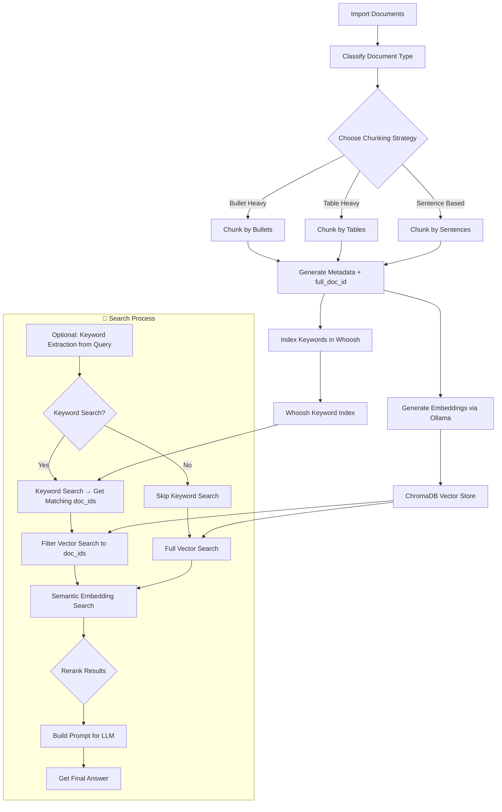

```mermaid
flowchart TD
  A[Import Documents] --> B[Classify Document Type]
  B --> C{Choose Chunking Strategy}

  C -->|Bullet Heavy| D[Chunk by Bullets]
  C -->|Table Heavy| E[Chunk by Tables]
  C -->|Sentence Based| F[Chunk by Sentences]

  D --> G[Generate Metadata + full_doc_id]
  E --> G
  F --> G

  G --> H[Index Keywords in Whoosh]
  G --> I[Generate Embeddings via Ollama]

  H --> J[Whoosh Keyword Index]
  I --> K[ChromaDB Vector Store]

  subgraph Search ["🔎 Search Process"]
    L1[Optional: Keyword Extraction from Query]
    L1 --> L2{Keyword Search?}

    L2 -->|Yes| L3[Keyword Search → Get Matching doc_ids]
    L2 -->|No| L4[Skip Keyword Search]

    L3 --> M1[Filter Vector Search to doc_ids]
    L4 --> M2[Full Vector Search]

    M1 --> N[Semantic Embedding Search]
    M2 --> N

    N --> O{ Rerank Results}
    O --> P[Build Prompt for LLM]
    P --> Q[Get Final Answer]
  end

  J --> L3
  K --> M1
  K --> M2

```
