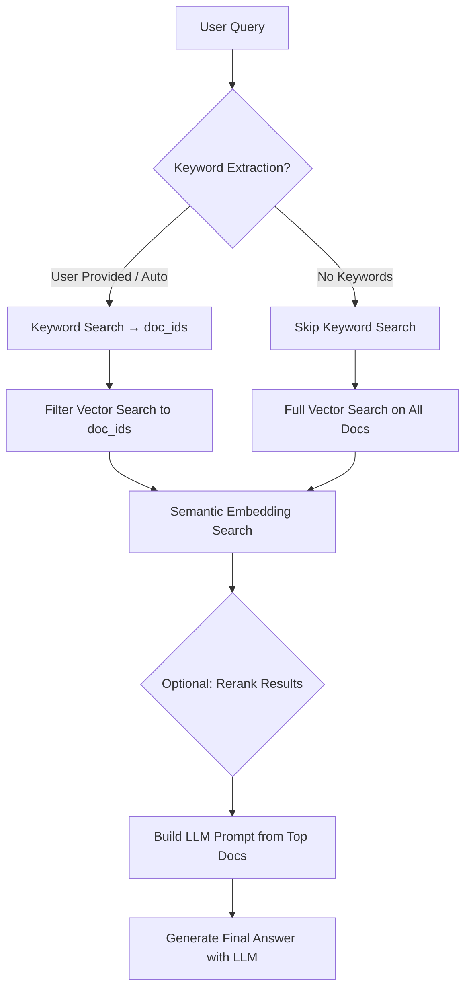

# Search Process

```mermaid
flowchart TD
  A[User Query] --> B{Keyword Extraction?}

  B -->|User Provided / Auto| C[Keyword Search → doc_ids]
  B -->|No Keywords| D[Skip Keyword Search]

  C --> E[Filter Vector Search to doc_ids]
  D --> F[Full Vector Search on All Docs]

  E --> G[Semantic Embedding Search]
  F --> G

  G --> H{Optional: Rerank Results}
  H --> I[Build LLM Prompt from Top Docs]
  I --> J[Generate Final Answer with LLM]


```
