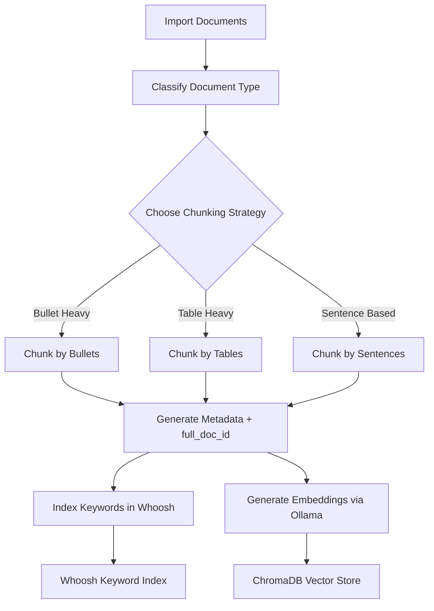

# Import Process

```mermaid
flowchart TD
  A[Import Documents] --> B[Classify Document Type]
  B --> C{Choose Chunking Strategy}

  C -->|Bullet Heavy| D[Chunk by Bullets]
  C -->|Table Heavy| E[Chunk by Tables]
  C -->|Sentence Based| F[Chunk by Sentences]

  D --> G[Generate Metadata + full_doc_id]
  E --> G
  F --> G

  G --> H[Index Keywords in Whoosh]
  G --> I[Generate Embeddings via Ollama]

  H --> J[Whoosh Keyword Index]
  I --> K[ChromaDB Vector Store]
```
