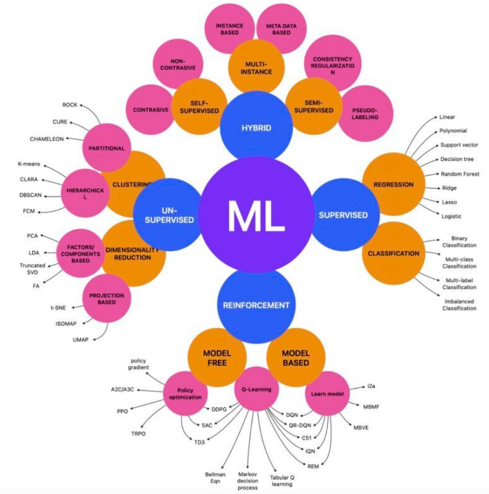

# Artificial-intelligence
All Things Artificial intelligence - John O'Sullivan

## Great Resources for up to the Minute AI Reporting

- [AI Snake Oil](https://www.aisnakeoil.com/)
- [The Pragmatic Engineer](https://blog.pragmaticengineer.com/)
- [Import AI](https://jack-clark.net/)
  
## Remaining AI challenges in 2023

### The Alignment Problem

In AI, the alignment problem refers to the challenge of ensuring that an AI system's objectives and behaviors remain aligned with the objectives of its human operators or designers over time. This is particularly important in cases where the AI system has a high degree of autonomy or where its actions can have significant real-world consequences.

For example, in the case of a self-driving car, the alignment problem arises when we want the car to take actions that are in line with human values and preferences. However, as the car's algorithms become more complex and the car encounters novel situations, there is a risk that it may deviate from these values and act in ways that are unexpected or undesirable.

"The Alignment Problem: Machine Learning and Human Values" by Brian Christian is a book that explores the challenges of aligning artificial intelligence (AI) with human values and the potential risks associated with AI systems that operate in misalignment with human values.

The book argues that the alignment problem is not just a technical issue but also a philosophical, sociological, and ethical one, and that solving it requires interdisciplinary collaboration across multiple fields.

It discusses various approaches to achieving alignment, such as value alignment, corrigibility, and interpretability, and examines their limitations and potential drawbacks. The book also explores the risks associated with AI systems that are not aligned with human values, such as unintended consequences, misuse, and the potential loss of control over the systems.

The book identifies a number of Ethical Issues associated with AI:

- Bias and fairness: Machine learning algorithms can perpetuate and even amplify existing biases in society, leading to unfair treatment of certain groups.
- Privacy and surveillance: AI systems can collect and process large amounts of personal data, raising concerns about privacy violations and the potential for surveillance.
- Autonomy and control: As AI systems become more autonomous, questions arise about who is responsible for their decisions and actions, and how much control humans should have over them.
- Accountability and transparency: It can be difficult to understand how some AI systems make decisions, which can make it challenging to hold them accountable for their actions.
- Existential risk: Some experts worry about the potential for super-intelligent AI to pose an existential risk to humanity if it is not aligned with human values.

### Inherent Bias

AI is prone to inherent bias due to small training datasets. AI algorithms demonstrate bias, and can subtly perpetuate it. Many of these acquired biases are not the fault of the algorithms, but instead are a mirror of society and culture. In the 1950's, people tried to predict, using punch card machines, which prisoners would succeed on parole. A ProPublica study was conducted of the accuracy of COMPAS (Correctional Offender Management Profiling for Alternative Sanctions). COMPAS is used to predict whether an inmate, if released, would commit a violent or a nonviolent crime within 1-3 years. The algorithm was found to be biased against black people; it over-predicts recidivism among blacks, and under-predicts for whites. A key factor is that it actually does not predict whether a released prisoner would commit a crime. It really predicts whether a released prisoner would be arrested and convicted for a crime. Higher rates of police profiling blacks lead to an inherent bias and this bias was acquired by the system.

### Common Sense

AI cannot do "Common Sense" and this is the dark matter of intelligence. Normal matter is what we see, what we can interact with, but dark matter is the stuff of the universe that we know is there but cannot see. Common sense is like that dark matter, it is the unspoken, implicit knowledge that we all have. It’s so obvious that we often don’t talk about it. Consider the question "Can birds fly?" The obvious answer is "yes", but there are exceptions and it turns out that exceptions are not exceptional, humans can think of them even though nobody told us specifically about these exceptions - we simply apply common sense to derive these exceptions.

### Value pluralism

Value is not singular, when it comes to value there is no universal truth. A lot of people feel uncomfortable about this because as scientists, we are trained to be very precise and strive for one truth, but in many areas of human knowledge there is no universal truth. The rules that might derive truth cannot easily be written down as universal truths, because when applied in different contexts, that assumed truth will lose its relevence.

### Types of Machine Learning

#### Supervised Learning

Supervised and unsupervised learning are two main categories of machine learning. The main difference between the two is the presence or absence of labeled data during the training process.

Supervised learning is a type of machine learning where the input data is labeled with the correct output values. The goal of supervised learning is to learn a mapping from input to output by training a model on labeled data. The model is then used to make predictions on new, unseen data. Examples of supervised learning include image classification, speech recognition, and sentiment analysis.

#### Unsupervised Learning

Unsupervised learning is a type of machine learning where the input data is not labeled with the correct output values. Instead, the goal of unsupervised learning is to find patterns or structure in the input data. Unsupervised learning algorithms try to learn relationships and structure in the data without any explicit guidance. Examples of unsupervised learning include clustering, anomaly detection, and dimensionality reduction.

### The difference between Machine Learning and Deep Learning

Machine learning is a subfield of artificial intelligence that focuses on the development of algorithms that can learn from data without being explicitly programmed. It includes various techniques such as linear regression, logistic regression, decision trees, random forests, and support vector machines.

Deep learning is a subset of machine learning that uses artificial neural networks with multiple layers to extract features from data and learn more complex representations. It can handle high-dimensional input data such as images, speech, and text. Deep learning algorithms, such as convolutional neural networks (CNNs) and recurrent neural networks (RNNs), have achieved state-of-the-art performance in various tasks such as image recognition, speech recognition, natural language processing, and game playing.

Traditional machine learning algorithms such as decision trees, random forests, support vector machines, and k-nearest neighbors do not involve neural networks, but increasingly machine learning is beginning to use neual networks.

## Large Language Models

A large language model typically refers to a sophisticated and powerful natural language processing (NLP) model that has been trained on a vast amount of diverse textual data. These models are designed to understand and generate human-like text. The term "large" usually indicates that the model has a substantial number of parameters, enabling it to capture complex patterns and relationships in language.

One of the notable examples of large language models is OpenAI's GPT (Generative Pre-trained Transformer) series, where "large" refers to the number of parameters in the model. For instance, GPT-3, the third iteration in the series, had 175 billion parameters.

- [Introduction to Large Language Models - Andrej Karpathy](https://www.youtube.com/watch?v=zjkBMFhNj_g)
- [Notes on LLMs](./LLMs/ReadMe.md)

## Natural Language Processing

- [Spacy](https://github.com/johnosbb/ProgrammingInPyQT/tree/main/Spacy)

### Text Classification

- [Text Classification in NLP](https://github.com/johnosbb/Artificial-intelligence/blob/main/text-classification.md)  
- [Log Analysis Example](./Classification/Syslog/log_analysis_with_machine_learning.md)

## Image Generation

- [Stable Diffusion](stablediffusion.md)
- [DreamBooth](dreambooth.md)
- [Textural Inversion](https://huggingface.co/docs/diffusers/training/text_inversion)
- [Image Creation with Bing](https://www.bing.com/create)

## Text Generation

### GPT-3 OpenAI

A GPT Model at its core is simply trying to predict the “right” text sequence that should follow the input it just got (based on what it has seen during training). GPT3/4 are mathematical models, represented as mathematical functions. They don’t understand words or text, just numbers. Essentially each “word” in the text sequence gets converted to a fixed length vector of numbers that is unique to the word itself. We end up with a vector (i.e. collection of numbers) for each word in the input sequence. If the input was “What is life”, we end up with 3 different vectors for each of the words (e.g. [0.1, 0.03, 0.93], [0.24, 0.61, 0.43], [0.11, 0.39, 0.20]). These vectors are called embeddings (i.e. mathematical representations of the words in your input). There are many ways to do this, and different models can do this differently.

Position encoding transforms these embeddings using mathematical functions/models to produce new vectors for each word and these new vectors mathematically incorporate word position information into the embedding.
For each position encoded vector for a word we create a query vector for that word in that position — this just means the input position encoded vector goes through a mathematical function (whose parameters are trained during training) to produce a new vector that is referred to as the query vector. We then use the vector to create a key vector for that word in that position —i.e. the input position encoded vector goes through another (different) mathematical function to produce another new vector that is referred to as the key vector. Then we create a value vector for that word in that position — i.e. the vector goes through yet another mathematical function to produce yet another new vector that is referred to as the value vector.

The dot product of a query vector (of any word) and a key vector (of any word) is a single number that represents the “similarity” or attention the network needs to provide to one word in context of the other. So we end up with an attention score for each word of our input. The attention score denotes how important one word is in context of another. Each word can therefore have a varying number of attention scores. Once we have the attention vectors for each word, we will then apply the softmax function to each attention vector to ensure all of its attention scores (i.e. with respect to itself and its preceding words) add up to 1.0. Now that we have attention scores, we have to calculate the output of the self-attention layer. The final output of the self attention layer for a specific word is a weighted sum of value vectors of the word itself and all preceding words where the value vector of a word is weighed by its attention score with respect to the current word.

[See also](./LLMs/ReadMe.md)

- [Understanding Self Attention and GPT models](https://medium.com/@sntaus/understanding-self-attention-gpt-models-80ec894eebf0)
- [OpenAI Home Page](https://openai.com/api/)
- [GPT-3 Tutorial](https://www.youtube.com/watch?v=Zb5Nylziu6E)
- [Open AI Python Library](https://github.com/openai/openai-python)
- [OpenAI Quick Start](https://beta.openai.com/docs/quickstart/build-your-application)
- [Galactica - scientific model](galactica.md)

## Animation Generation

- [Youtube Tutorial](https://www.youtube.com/watch?v=qUk2_h9lQYU)
- [Deforum Model](https://colab.research.google.com/github/deforum/stable-diffusion/blob/main/Deforum_Stable_Diffusion.ipynb)
- [FiLM: Frame Interpolation for Large Motion](https://colab.research.google.com/github/pytti-tools/frame-interpolation/blob/main/PyTTI_Tools_FiLM-colab.ipynb#scrollTo=-7TD7YZJbsy_)
- [Stable Diffusion Videos](https://colab.research.google.com/github/nateraw/stable-diffusion-videos/blob/main/stable_diffusion_videos.ipynb)

## Genetic Algorithms

- [EasyGA](./easyga.md)
- [pyEasyGA](./pyeasyga.md)
- [PyGAD](./PyGAD.md)
- [Using GA to generate Music](https://www.cse.chalmers.se/~abela/supervision/kandidat2014/DATX02_14_11.pdf)

## Pytorch

- [Pytorch Functional Api](https://jeancochrane.com/blog/pytorch-functional-api)

