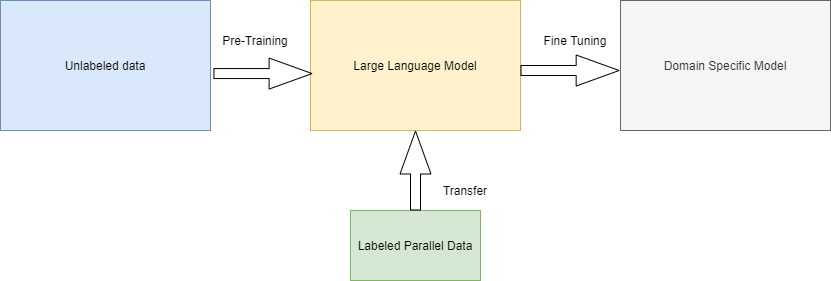
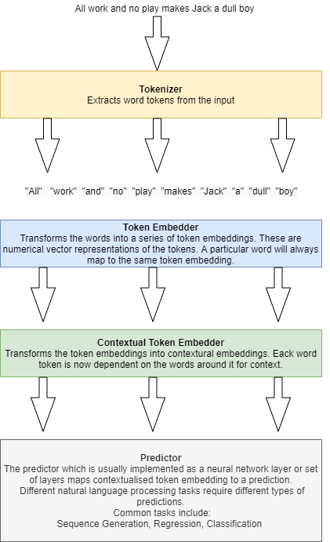

# Removing Subjectivity

## Introduction

The goal of subjectivity removal in text  is to generate a modified version of a given input sentence with the same semantic meaning, but in a neutral tone of voice. This is a classic generative modelling problem.

Language Models are based on a learned probability distribution over a sequence of words. We can use this probability distribution to estimate the conditional probability of the next word in a sequence, given the prior words as context.

Auto-regression lies at the heart of language modelling. It allows us predict future values from past values (i.e. guess the next token having seen all the previous ones).  This approach is fine for the more general case of text generation, but for the task of removing subjectivity from text input we need to generate text that is based on our input and a conditioning context.

A Seq2Seq (sequence-to-sequence) model is a type of neural network architecture designed for tasks involving sequential data, where the input and output are both sequences of data. This architecture is particularly popular in natural language processing (NLP) and machine translation tasks.

The Seq2Seq model consists of two main components:

- Encoder: The encoder processes the input sequence and transforms it into a fixed-size context vector or hidden state. The context vector encapsulates the information from the entire input sequence in a condensed form.

- Decoder: The decoder takes the context vector generated by the encoder and uses it to generate the output sequence step by step. The output sequence is constructed one element at a time, and the decoder's hidden state is updated at each step.

The typical use case for Seq2Seq models is in tasks where the length of the input sequence is not necessarily the same as the length of the output sequence. Some common applications include:

- Machine Translation: Translating sentences or phrases from one language to another.
- Text Summarization: Generating a concise summary of a given input text.
- Speech Recognition: Converting spoken language into written text.
- Conversational Agents: Generating responses in a conversation.

In the context of machine translation, for example, the input sequence might be a sentence in one language, and the output sequence would be the translation of that sentence in another language. Given these use cases then one might assume that 'Text Style Transfer' and 'Subjectivity Removal' may stand to benefit from the conditional language model approach.

## Self Supervised Learning

Self-supervised learning is a machine learning paradigm where models are trained to learn from unlabeled data without explicit supervision. This is very important for tasks like subjectivity removal where the availability of labeled datasets featuring text with and without subjectivity is limited.

Self supervised learning allows us to first pre-train a general language model on enormous bodies of unlabeled text to develop a basic understanding of the English language. We can then leverage this robust representation and fine tune the model with the limited sets of parallel training examples to allow the model extract specific patterns attributed to subjective style. This process is known as transfer learning.

## Transfer Learning

Transfer learning is a machine learning technique where a model trained on one task is repurposed for a different, but related, task. In transfer learning we use the terms source task and target task. The source task is the related task we can use to pre-train our model. This source task can often use non-labelled data which may be more readily available. The target task will often require labelled data which may not be so abundant. will The idea is to leverage knowledge gained from solving a source task to improve learning on the target task. Instead of training a model from scratch for the target task, transfer learning initializes the model with knowledge obtained from a pre-trained model on the source task. Transfer learning as a technique attempts to take advantage of the fact that the pre-training tasks and the target task are all related in some way. This relationship, for example, may simply be the ability to process and extract information from text.

The typical transfer learning process involves the following steps:

- Pre-training: A model is initially trained on a large dataset for a source task. This pre-training phase enables the model to learn generic features and representations that can capture underlying patterns in the data.
- Transfer: The pre-trained model is then fine-tuned or adapted for a target task using a smaller dataset specific to the target task. The knowledge gained during pre-training is transferred to enhance the model's performance on the new task.

Using this approach we can leverage the power of existing models. There are many state-of-the-art pre-trained models that are published openly and can be used in the pre-training process.

## NLP Models and Transfer Learning

- __Tokenizer__ : Extracts word tokens from the input.
- Token Embedder: Transforms the words into a series of token embeddings. These are numerical vector representations of the tokens. A particular word will always map to the same token embedding.
- __Contextual Token Embedder__: Transforms the token embeddings into contextual embeddings. Each word token is now dependent on the words around it for context.
- __Predictor__: The predictor which is usually implemented as a neural network layer or set of layers maps contextualised token embedding to a prediction. Different natural language processing tasks require different types of predictions. Common tasks include: Sequence Generation, Regression and Classification.

While the initial token embedding stage focuses on learning the meanings of individual words, the subsequent contextualized embedding stage plays a crucial role in capturing the semantic meaning of entire language sequences. In this stage, the model must acquire a broad spectrum of linguistic information, encompassing tasks such as entity recognition, negation identification, co-reference resolution, and understanding dependency relationships within the text.

Previously, researchers expressed concerns about the feasibility of transferring knowledge at the contextualization level. This skepticism stemmed from the need for embeddings to be highly generalizable and abstract enough to facilitate effective transfer learning. However, recent advancements, particularly in models predicting missing words, have paved the way for successful contextualization-level transfer learning. These predictor models demand a profound understanding of language, allowing them to leverage pre-trained data effectively. Modern language models, trained on extensive datasets, produce contextualizers capable of encoding diverse and general language features, proving valuable across a spectrum of related tasks. The pretrained contextualizers learn a broad set of language skills, understanding both short- and long-range relationships within language; the downstream tasks which require one or more of these skills benefit from these features. 

## Target Datasets for Subjectivity Removal

Because Wikipedia enforces this neutrality policy and maintains a complete revision history, the encyclopedia edits associated with an NPOV justification can be parsed out to form a dataset of aligned (subjective vs. neutral) sentence pairs. [See here for more detail](https://arxiv.org/pdf/1911.09709.pdf)

